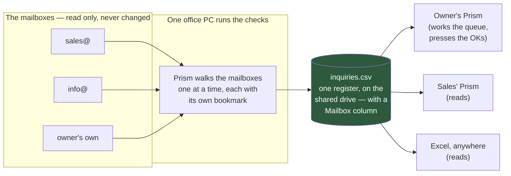

# Email automation — several inboxes, one register, and the OK signal

**Where this came from:** a second company visit, after the spring maker's.
Their words, roughly: *the majority of our work runs on Gmail — customer
follow-ups, inquiry mails, purchase-order mails, quotation mails. Several of
us receive them, on several addresses, and everything gets copied by hand
into one Excel sheet the whole office reads. Automate that: we configure our
email, Prism handles the workflow from the inquiry to the last step, the data
all lands in the same sheet, and we just give the OK.*

That is not a new product. It is the workflow
[EMAIL_WORKFLOW.md](EMAIL_WORKFLOW.md) already describes and the engine
already runs — asked for at the scale of an office instead of a desk. This
document covers what that scale adds, why a business pays for it, and what
was deliberately left for later. The per-inquiry lifecycle (sort → register →
quote → chase → reply → PO) is unchanged and documented there; the runtime
truth — which brain does which job, the five human moments — is
[EMAIL_WORKFLOW_RUNTIME.md](EMAIL_WORKFLOW_RUNTIME.md).

---

## 1. The one-line version

> Today three inboxes are read by three people who each retype their half
> into one shared sheet. Prism reads all three, keeps the one sheet, prepares
> every reply, and the owner presses OK where money moves — twice.

---

## 2. What the office-scale version adds

**Every mailbox, one walk.** The mailbox step of Setup takes a list now.
Each account keeps its own read bookmark — two mailboxes sharing one would
skip or re-import each other's mail — and the sorter's learned corrections
are shared, because a sender is the same sender whichever address they wrote
to. The walk is one at a time, never parallel: all of it lands in one
register, and the engine's own rule ("two fetches racing on one bookmark
registers the same inquiry twice") becomes "N fetches racing on one order
book" the moment there are N accounts.

**One dead mailbox is skipped; one locked register stops the walk.** Opposite
responses on purpose. A mail server that does not answer is that account's
problem and the others carry on. A register open in Excel would refuse every
account identically, and no bookmark has moved — so the walk stops, says the
one sentence, and everything comes back on the next check.

**The register is the centralised system.** It always was one ordinary CSV;
what changed is that Setup now says so out loud and offers the shared drive
(one click when the team workspace is set up). Everyone opens the same file —
in Prism or in Excel — which is exactly the sheet the office already keeps,
minus the typing. A **Mailbox** column records which address each inquiry
arrived at, because with three addresses feeding one file, "who is this
customer talking to" is the first question the sheet gets asked.

**One machine does the writing.** The office PC that stays on runs the
checks and holds the mailbox passwords; every other machine reads. This is a
rule, not a limitation we hide: two Prisms writing one order book is how a
row gets lost, and the always-on PC in the corner is the same advice the
runtime doc has always given. (Passwords never touch the shared folder —
they stay in the watcher's own config, as they always have.)

**The last step now has its screen.** The engine could read a purchase order
and compare it to the quotation since Round 3; no screen ever called it. Tab
**5 · The order came** closes that: the PO is read into fields (a direct
Groq call — seconds), put against the quotation *actually sent* (read back
from the CSV written at send time, refused if it does not add up to the
paisa), and every difference is listed — a rate difference measured in money
multiplied out by quantity, because ninety paise on five thousand pieces is
₹4,500 walking past a one-rupee tolerance. **Accept — mark converted** is a
button a person presses. Scanned POs (half of them) get typed-in boxes and an
honest sentence, and the same boxes serve anyone who switched on *Keep
everything on this computer* — a PO is mail content, and the privacy switch
means what it says even when that costs the automatic reading.

---

## 3. The OK signal — where automation stops, and why that sells

The customer asked for "we just give the OK and the rest is automatic". That
is precisely the existing design, and it is worth saying back to them in
their own words:

| Runs by itself | Waits for the OK |
|---|---|
| Reading every mailbox, sorting, filing drawings | — |
| Numbering and registering each inquiry, in the shared sheet | — |
| Working out the price from their rate list or cost sheet | **Sending the quotation** — money |
| Reading the customer's reply | Applying it to the register when it is unclear |
| Chasing quiet quotations (once switched on) | — |
| Reading the PO and listing every difference | **Accepting the PO** — money |

Two OKs per order, both about money leaving or arriving. Everything else is
unattended. The "send unless stopped" softening — quotation goes out in ten
minutes unless the owner taps Hold — stays exactly where
EMAIL_WORKFLOW_RUNTIME.md §1 put it: sanctioned, designed, and not built
until a customer who has used the two-click version for a month asks.

---

## 4. Why a business pays for this — the evidence

Numbers a salesperson can say out loud, with where they come from. (One
famous statistic is deliberately missing: "80% of sales take five follow-ups"
traces to an association that does not appear to exist, and we do not sell
with folklore.)

**Speed wins the inquiry.** The classic Harvard Business Review lead-response
audit found firms answering within an hour were roughly seven times likelier
to qualify the lead — and the average business takes about 47 hours to
respond, with [74% missing the five-minute window
entirely](https://leadresponse.co/blog/speed-to-lead-statistics). Between a
third and half of sales go to the vendor who responds first
([InsideSales research, summarised
here](https://www.leadangel.com/blog/operations/speed-to-lead-statistics/)).
A GIDC inbox checked every ten minutes with the quotation drafted before the
owner has seen the mail is a response-time no manual office can match.

**Follow-up is the leak.** [44% of salespeople give up after one
follow-up](https://www.invespcro.com/blog/sale-follow-ups/); most quotes die
of silence, not rejection. Prism's chase list is the money already earned
and not yet collected on — and §8 of EMAIL_WORKFLOW.md showed why "Waiting
on a reply: 14" is the number that renews the subscription.

**Manual order entry costs real money.** Industry studies put a manually
processed purchase order at [tens of minutes of retyping and error rates of
1.6–3% per document](https://tryleverage.ai/blog/manual-vs-automated-purchase-order-processing),
with [APQC/CAPS putting fully-loaded manual processing costs in the hundreds
of dollars per order](https://conexiom.com/blog/why-enterprises-are-struggling-with-order-management-and-how-to-fix-it);
automation cuts those error rates by roughly 90%. Prism's version of that
argument is sharper than the generic one: the PO is not just entered, it is
*compared* — the silently reduced rate is caught in two seconds instead of
three weeks later.

**The alternative they tried is a CRM, and CRMs die here.** [Roughly 63% of
CRM initiatives fail](https://rethinkrevenue.com/why-crms-fail-understanding-the-challenges-and-statistics/),
overwhelmingly on adoption — salespeople will not do data entry that serves
somebody else's dashboard, and [only about half of ten-person businesses use
any CRM at all](https://heydan.ai/articles/why-crm-adoption-fails-and-how-to-finally-fix-it).
Prism sidesteps the adoption problem instead of fighting it: nobody enters
anything (the inbox is the entry), and the output is the Excel sheet the
office already trusts. §13 of EMAIL_WORKFLOW.md carries the rest of the
anti-CRM position — starts at the inbox, reads drawings, customer list never
leaves the building.

**The market context.** India has some 63 million MSMEs at [about 18% of
large-enterprise productivity](https://www.ey.com/en_in/insights/technology/how-can-manufacturing-and-msme-s-grow-faster-with-digital-transformation),
and the commonest digitisation barrier reported is not cost but resistance
to changing tools. A product that changes no tools — same mailboxes, same
Excel sheet, same approvals, minus the typing — is built for exactly that
buyer. Priced as an add-on per FUTURE_INDUSTRY_TARGETS.md, never standalone.

---

## 5. What this change shipped, and what it deliberately did not

Shipped (all behind the existing `inbox` licence feature — the SKU did not
move, only the name on the shelf):

1. The mailbox list, per-account bookmarks, the one-at-a-time walk, per-
   account password back-off, and failures that name their mailbox.
2. The **Mailbox** column, stamped once per inquiry and never rewritten.
3. Setup that says the shared-drive sentence and offers the team folder.
4. Tab 5 — the PO read, the comparison against the sent quotation, and the
   Accept button. The send path note in README still stands: written and
   tested against fixtures, not yet against a real customer's mailbox.
5. The rename: the shelf item is **Email automation**, because that is the
   phrase both prospect companies used. Keys, licence features and file
   formats are unchanged.

Deliberately not built, each with its trigger (the two code-adjacent ones
are also in [DEFERRED.md](DEFERRED.md), per its house rule):

| Not built | Why not now | What would change our minds |
|---|---|---|
| Several machines writing one register | A lock file on an SMB share is the kind of code that corrupts a twenty-year order book on a bad Tuesday. One watcher + N readers delivers the customer's actual ask. | A customer whose salespeople refuse to put their mailbox passwords on the office PC — heard twice. |
| Google Sheets / cloud sync | The anti-cloud position IS the pitch ("the customer list never leaves the building"). A shared-drive CSV opens in Excel today. | A customer who runs on Sheets and will not mount a shared folder, saying they would pay. |
| Send-unless-stopped and auto-send under a value | Trust is earned in weeks, not shipped in v1. The gate table in EMAIL_WORKFLOW_RUNTIME.md already designs it. | One customer using the two-click flow daily for a month and asking for it. |
| Scanned-PO OCR | An OCR misread of a rate is worse than typing four fields. The typed-in boxes are honest and fast. | Scanned POs above ~half of a real customer's volume, counted, not guessed. |
| Payment reminders, proforma invoice, WhatsApp, Tally | §10 of EMAIL_WORKFLOW.md, in the order they are worth money. Unchanged. | Ask, at the next visit, which of these they would pay extra for. |

---

## 6. What to say at the next meeting

> *"You said it yourself: everything is email and one Excel sheet. Point
> Prism at every mailbox the inquiries come to — sales@, info@, yours — and
> it keeps that same sheet, on your own shared drive, with a column saying
> which address each inquiry came to. It quotes from your rate list, chases
> the quiet ones, and when the PO lands it shows you exactly what changed
> from your quotation before you accept it. Nothing goes to a customer and
> no order is accepted without your OK — those two clicks are yours. It runs
> on your own PC; nothing about your customers goes to anybody's cloud."*
