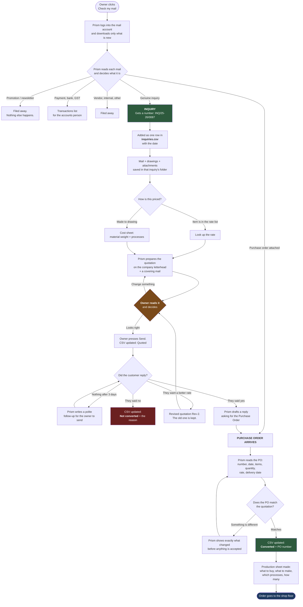
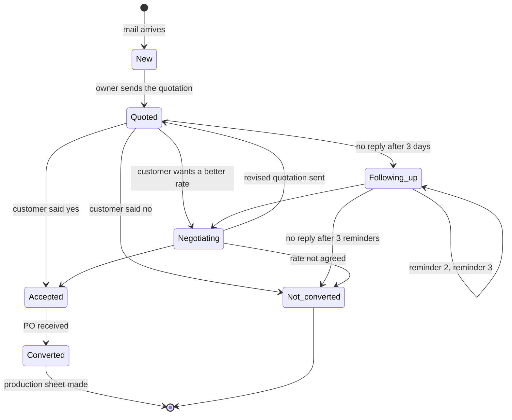

# Inbox to Order — the workflow GIDC asked for

**Where this came from:** a spring manufacturer at GIDC, in person. Their words,
roughly: *let Prism read my mail, sort it, keep my inquiries in one file, make
the quotation from my own rate list, track whether the customer said yes or no,
and when they send the PO, make the production sheet.*

This document is written in plain language. No jargon, and where something is
hard or risky it says so instead of hiding it.

**Companion:** [EMAIL_WORKFLOW_RUNTIME.md](EMAIL_WORKFLOW_RUNTIME.md) — how
Prism actually runs it: which AI does which job, which code, his day hour by
hour, and every point where a person is needed.

---

## 1. The one-line version

> Today an inquiry arrives by mail, someone reads it, someone types a quotation
> in Excel, someone mails it back, and then everybody forgets about it.
> Prism does the reading, the typing and the remembering. **The owner still
> presses Send.**

---

## 2. The whole thing as a picture



---

## 3. The life of one inquiry

Every inquiry sits in exactly one state. This is what the CSV column says.



---

## 4. What the owner sets up once

Done on day one, then never again unless something changes.

| What | Why | Where it is kept |
|---|---|---|
| Mail account and password | So Prism can read the inbox | The computer's own password store, **never** in a shared folder |
| Rate list (Excel or CSV) | So Prism knows the prices | The company folder |
| Letterhead / quotation format | So the quote looks like theirs | The company folder |
| Standard terms | GST %, validity, delivery, payment | Settings |
| Who is a customer, who is a vendor | Makes sorting accurate from day one | Settings |

**About the mail account.** They are not on Gmail, and that is fine — it is
better. Almost every business mail account on a company domain speaks a
standard called IMAP, which is how Outlook and phones already read it. Prism
uses the same door. Nothing to install, no permission screen from Google, no
account to connect.

Prism already sends mail this way (`core/mailer.py`), through the customer's
own account, using the same host table and the same "your provider wants an app
password" error messages. Reading is the new half.

---

## 5. The inquiry file

One file, `inquiries.csv`, that keeps growing. One row per inquiry. It opens in
Excel and it is theirs — if Prism is uninstalled tomorrow the file still works.

| Column | Example |
|---|---|
| Inquiry number | INQ/25-26/0087 |
| Date received | 10-08-2026 |
| Customer | Shakti Auto Components |
| Contact person | Mr. Patel |
| Email | purchase@shaktiauto.in |
| Phone | 98250 xxxxx |
| Product asked | Compression spring, 2 mm wire, 25 mm OD |
| Quantity | 5000 nos |
| Drawing attached | Yes — saved in the inquiry folder |
| Status | Quoted |
| Quotation number | QTN/25-26/0142 |
| Quotation date | 11-08-2026 |
| Quotation value | ₹ 1,42,500 |
| Reminders sent | 2 |
| Customer replied on | 19-08-2026 |
| Result | Converted |
| Reason if lost | Rate high — lost to local competitor |
| PO number | SAC/PO/4471 |
| PO date | 20-08-2026 |
| Order value | ₹ 1,38,000 |
| Folder | inquiries/INQ-25-26-0087/ |

Alongside it, **one folder per inquiry** holding the original mail, the
drawings, the quotation that was sent, the reply, and the PO. So "show me
everything about this inquiry" is one folder, not a search through the inbox.

A month-end copy is written separately, so the register can be handed to the
accountant without giving them the live file.

---

## 6. How the quotation gets its rates

Two different situations, and the difference matters for a spring maker.

**Situation one — it is a listed item.** The rate list has a row for it. Prism
finds the row, applies the quantity slab, adds GST and freight, done.

**Situation two — it is made to a drawing.** Most spring inquiries. There is no
"rate" to look up, because nobody has made this exact spring before. What the
owner actually does in their head is a cost sheet:

```
    material weight  ×  rate per kg of that wire grade
  + coiling / setting charge
  + heat treatment
  + plating or finishing
  + packing
  + margin
  ─────────────────────────────
    rate per piece
```

So the "rate file" they upload is really two things: a price list **and** a
cost sheet with their own rates for each of those lines. Prism fills the
numbers in, the owner sees the working, and can change any line before it goes
out.

**If a drawing is attached, Prism can read it.** The existing BOQ engine already
measures lengths, areas and counts out of a DWG or DXF. Wire diameter, outside
diameter, free length, number of coils — those feed the cost sheet directly.
That is the part no CRM in the market does.

---

## 7. From PO to the production sheet

The manufacturer's PO tells you what was ordered. The production sheet tells the
shop floor what to buy and what to make. Prism's existing engine already splits
a job into **bought-out items** (wire, packing, plating done outside) and
**fabricated items** (what the shop makes), which is exactly this document.

Before that happens Prism puts the PO and the quotation side by side and points
out anything that differs — a rate that was reduced, a quantity that changed, a
delivery date that cannot be met. That check takes two seconds and it is the
one that saves an argument three weeks later.

**Rate and amount columns are left blank on purpose.** Prism gives quantities.
The costing stays with the owner. This is deliberate and it should be said out
loud in every demo.

---

## 8. What the owner sees at the end of the month

- Inquiries received: 34
- Quoted: 31 — worth ₹ 41,20,000
- Converted: 9 — worth ₹ 11,80,000
- Conversion rate: 29%
- **Waiting on a reply: 14** ← the money sitting on the table
- Lost, and why: 6 on rate, 2 on delivery time, 4 no reply

That last list is the reason to buy this. Nobody in a GIDC unit knows their own
conversion rate today.

---

## 9. Where this can go wrong — read before promising anything

| Risk | What actually happens | What we do about it |
|---|---|---|
| **Customer data leaves the building** | To sort a mail, its text has to be understood. If that goes to an outside AI service, their customer list has left their office. | Sort locally by rules first — newsletters, known senders, auto-replies never leave the machine. Only genuinely unclear mail goes out, and the setting to turn even that off must exist. **Say this first in every demo, before they ask.** |
| **A wrong rate gets mailed out** | Real money lost, and it is our fault. | Prism never sends a price by itself. It drafts; the owner sends. This is also an easier sale — it does not replace anyone. |
| **The PO is a scan** | Half of them are. A photograph of a printout cannot be read as text. | Needs OCR. Until then, Prism asks the owner to type the four fields that matter. Do not promise scanned POs work on day one. |
| **The CSV is open in Excel** | On Windows, Prism cannot write to a file Excel has open. It fails silently in the worst case. | Write to a temporary file and swap it in; if it is locked, say "close the inquiry file in Excel" in plain words. |
| **Every company's quotation looks different** | If we hand-make a template per customer, we are a services company, not a product. | One template that reads the letterhead, logo and terms from settings. Custom formats are a paid one-time charge. |
| **Free-text matching is imperfect** | "2mm spring 25 OD" may match the wrong catalogue row. | Prism shows which row it picked and why, and the owner can change it in one click. Never silent. |
| **Office 365 and Gmail accounts** | These two no longer allow a plain password. | Gmail needs an app password, Microsoft needs a sign-in window. A company-domain account on normal hosting has neither problem — which is most of GIDC. |
| **Two people, one inbox** | Sales and the owner both processing the same mail. | Prism's roles already handle this. Sales sees inquiries, accounts sees transactions, the owner sees everything. |

---

## 10. Worth adding — in the order they are worth money

1. **Automatic follow-up.** Quote sent, no reply, forgotten. This is the single
   biggest leak in every small manufacturing business, and it is the cheapest
   thing on this list to build.
2. **"We quoted this customer before."** Before making a new quote, show what
   was quoted to the same customer for the same item last time. Stops them
   undercutting themselves.
3. **Why we lost.** One field, four choices. Three months later it is a report
   that changes how they price.
4. **Rate list versions.** Steel moves. When a customer comes back after two
   months, which price list was that quote made on?
5. **GST and HSN codes on the quotation.** Not optional in India. Comes from the
   rate file.
6. **Proforma invoice.** One button past the quotation. Needed to collect an
   advance, which is when the order becomes real.
7. **Payment reminders.** The second big leak: work delivered, payment overdue,
   nobody chasing. Same follow-up machinery as inquiries.
8. **Delivery challan and packing list** from the PO. Same data again.
9. **WhatsApp.** Be honest — in GIDC more inquiries arrive on WhatsApp than by
   mail. It is also the hardest one: the official route costs money per message
   and needs approval, and the unofficial route gets numbers banned. Worth
   raising with them, not worth promising.
10. **Tally.** Nearly every unit runs it. Pushing the converted order into Tally
    would be a real lever, and a real project. Ask how many of them would pay
    extra for it before building anything.

---

## 11. What to build first

Rough sizes, not promises.

| Order | Piece | State | Why here |
|---|---|---|---|
| 1 | Read the inbox and sort it | ✅ **built** | Half of it already existed. This alone demos well. |
| 2 | The inquiry register CSV | ✅ **built** | This is what they asked to see. |
| 3 | Follow-up reminders | ✅ **built** | Best money-per-hour on the whole list. |
| 4 | Quotation from the rate list | ✅ **built** | Where the product actually gets bought. |
| 5 | Reply tracking, converted / not converted | ✅ **built** | Closes the loop they described. |
| 6 | PO reading and comparison | ✅ **built** | Scanned POs still need typing in. |
| 7 | SOP sending and revision chasing | ✅ **built** | The easiest win he gave us. |
| 8 | Month-end numbers | ✅ **built** | The screen that renews the subscription. |
| 9 | **The screens he clicks in** | ✅ **built** | A plain launcher ("what needs you today") and one working window whose tabs follow the life of an inquiry — see EMAIL_WORKFLOW_RUNTIME.md §5. |

The engine is done and covered by 133 tests. What remains is the interface —
the mail-account setup, the worklist, the quotation review with its Hold
button, and the PO confirmation. Build those, then show it to five more units
before adding anything else.

---

## 12. One correction to carry into the next meeting

They said "BOQ" and we said "BOQ", and it was fine in the room. But strictly:
a **BOQ is the buyer's document** — the list a builder or consultant sends out
to get prices. What a manufacturer needs after a PO is a **BOM**, a bill of
materials, or a works order: what to buy, what to make, in what quantity.

Prism produces that already. It is only a naming thing. But saying "BOM" or
"production sheet" to a manufacturer sounds like we have made these before,
and saying "BOQ" sounds like we have only ever worked with builders.

---

## 13. Why they would pay for this instead of a CRM

Zoho, Vyapar and the rest all keep an inquiry register, and they are cheap.
Two things they do not do:

- **They start after the typing.** Somebody still has to read the mail and enter
  the inquiry. Prism starts at the inbox.
- **They cannot read a drawing.** Prism can, and for a made-to-order shop the
  drawing is the inquiry.

And the third thing, which matters more in GIDC than anywhere: **the customer
list never leaves the building.** For an owner who will not put his order book
on somebody's cloud, that is the whole argument.
