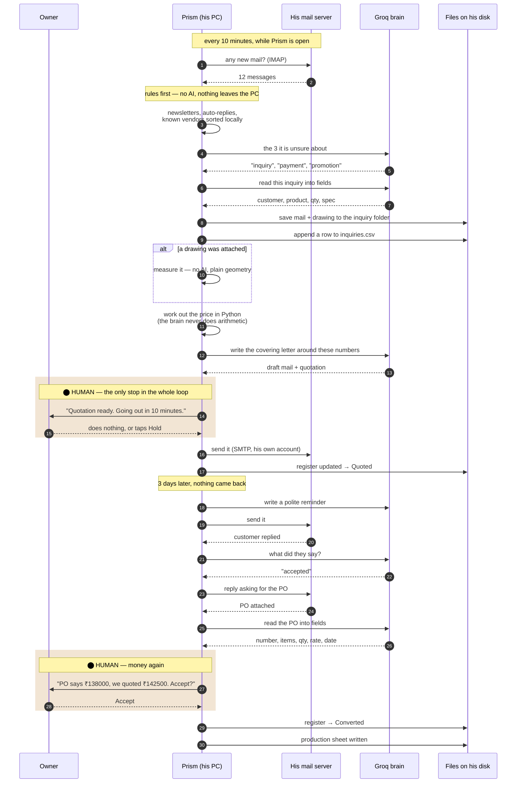
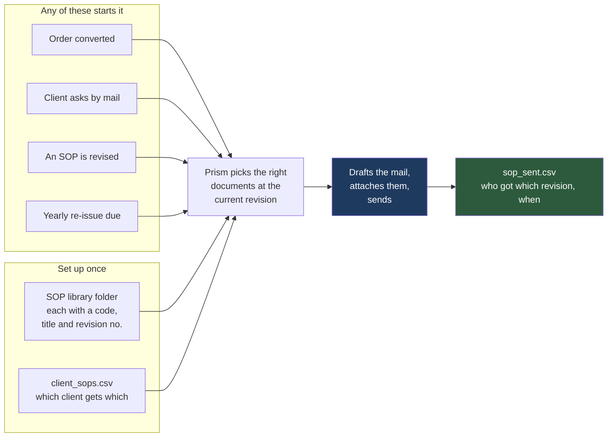

# How Prism actually runs it — a full working day

Companion to [EMAIL_WORKFLOW.md](EMAIL_WORKFLOW.md). That one is *what* happens.
This one is *how*: which brain does which job, which code runs, and the exact
moments a person has to be present.

---

## 1. The honest answer to "can this all be automated?"

Yes — technically, all of it. Prism can run the whole loop with nobody
watching.

**But three of the steps involve money leaving the company, and those should
stay on a click.** Not because the software can't do it. Because if Prism mails
a wrong rate to a customer, that is a real loss and it is our fault. Everything
that cannot cost him money if it goes wrong should run by itself.

| Step | Can it run untouched? | Verdict |
|---|---|---|
| Fetching and sorting mail | Yes | **Automate fully** |
| Filing attachments and drawings | Yes | **Automate fully** |
| Adding the inquiry to the register | Yes | **Automate fully** |
| Follow-up reminders | Yes | **Automate fully** |
| **Sending SOPs to clients** | Yes | **Automate fully** — see §6 |
| Working out the price | Yes | Automate the maths, show the working |
| **Mailing the quotation** | Yes, but | **One click.** Money. |
| Marking accepted / not converted | Mostly | Auto when the reply is clear, ask when it isn't |
| **Accepting the PO's numbers** | Yes, but | **One click.** Money. |
| Making the production sheet | Yes | **Automate fully** |

### The setting that gives him what he actually wants

He does not want to *approve* things. He wants to not be interrupted. Those are
different, and there is a pattern that gives him both:

> **Send unless stopped.** Prism prepares the quotation and says *"going out in
> 10 minutes."* He does nothing — it goes. He taps once — it waits for him.

From his chair that is full automation. From ours the escape hatch is still
there. Add a threshold on top: catalogue items under ₹50,000 with a rate that
matched cleanly go out on their own; anything made-to-drawing, or above the
figure he sets, waits for him. In his volume that is most mails going out
untouched.

---

## 2. One inquiry, end to end — who does what



---

## 3. His day, hour by hour

Assume Prism opens with Windows and sits in the tray.

| Time | Prism, by itself | Him |
|---|---|---|
| 09:30 | Wakes with the PC. Checks mail. 14 overnight messages sorted: 2 inquiries, 1 PO, 3 payments, 8 promotions. | Opens Prism. Sees one screen: **2 new inquiries, 1 PO waiting.** |
| 09:35 | Both inquiries already in the register, drawings saved, prices worked out, two quotations drafted. | Reads the first. Changes the delivery from 3 weeks to 4. Leaves the second alone. |
| 09:45 | Both go out. Register updated. | Nothing. |
| 09:50 | Shows the PO against last week's quotation — rate reduced by ₹4,500. | Looks, accepts. |
| 09:52 | Marks it converted. Writes the production sheet. Prints to the shop-floor folder. | Nothing. |
| 10:00–17:00 | Checks every 10 minutes. Files what is routine. Anything that needs him waits quietly in a list. | Runs his factory. |
| 13:00 | Two more inquiries arrive and are quoted the same way. | Two taps between lunch. |
| 15:30 | A regular client asks for the process document. Prism finds the right SOP at its current revision, drafts the reply with it attached. | Nothing — SOPs send themselves. |
| 17:30 | Nine quotations are past three days with no reply. Reminders drafted and sent. | Nothing. |
| 18:15 | End-of-day note: *4 inquiries, ₹6.2 lakh quoted, 1 order ₹1.38 lakh, 9 reminders sent, 14 still waiting.* | Reads it in fifteen seconds. |
| 18:30 | Closes with the PC. | Goes home. |

**Total time he spends: about six minutes, in four taps.** That is the number to
quote him. Not "automation" — *six minutes*.

---

## 4. Which brain does which job

Prism has two kinds of AI: the **Groq brain**, which is a direct API call and
takes a second, and the **browser tools** (ChatGPT, Perplexity, Canva…) which
Prism drives through a real Chrome window and take a minute or more.

> **For this workflow, almost nothing should use the browser tools.** They are
> right for research and content, wrong for a job that runs 40 times a day: they
> are slow, they need Chrome visible on his screen, and they break when a
> website changes its buttons. The whole inbox loop runs on direct API calls and
> plain Python.

| Job | What runs it | Why that one |
|---|---|---|
| Sorting a mail into a category | Groq — `llama-3.1-8b-instant` | It is a labelling job. Fast and nearly free. |
| Reading an inquiry into fields | Groq — `llama-3.3-70b-versatile` | Pulling out product, quantity and spec needs the better model. |
| Writing the covering mail | Groq — `llama-3.3-70b-versatile` | It is writing, in his tone. |
| Writing follow-up reminders | Groq — `llama-3.1-8b-instant` | Short, formulaic. |
| Understanding a reply | Groq — `llama-3.1-8b-instant` | Yes / no / negotiating. |
| Reading a PO into fields | Groq — `llama-3.3-70b-versatile` | Accuracy matters; the numbers are money. |
| **Measuring a drawing** | **No AI.** `core/boq.py` + ezdxf | Real geometry. A language model must never guess a dimension. |
| **Every price calculation** | **No AI.** Plain Python | A language model does arithmetic *approximately*. Compute the number in code, then let the brain write the sentence around it. This is not a preference — it is the difference between a quotation and a lawsuit. |
| **Choosing which SOP to send** | **No AI.** A lookup table | Client → SOP list. Nothing to think about. |
| Polishing an unusual letter | ChatGPT via Chrome, **only if he asks** | The one place a browser tool earns its minute. |

If Groq retires a model, `MODEL_FALLBACKS` in `core/router.py` already walks
down the list and the day continues. He never learns it happened.

---

## 5. Which code runs

### Already built — reused as is

| Piece | What it already does |
|---|---|
| `core/router.groq_chat()` | Every AI call in the list above. Retries, rate-limit waits, model fallback. |
| `core/router.MODEL_FALLBACKS` | Survives Groq retiring a model. |
| `core/mailer.smtp_for()` | Knows the send settings for each provider. |
| `core/mailer.clean_password()` | App passwords copied with spaces in them. |
| `core/mailer.explain_error()` | Turns a mail failure into a sentence he can act on. |
| `core/mailer.split_attachments()` | Attaching files to an outgoing mail. |
| `core/mailer.write_recipients_csv()` | The CSV-writing pattern the register copies. |
| `core/boq.ensure_dxf()` · `measure()` · `filter_by_keywords()` | Reads the attached drawing and measures it. |
| `core/boq.write_quantities_csv()` · `summary_text()` | The production sheet. |
| `core/boq.classify_inputs()` | Works out whether an attachment is a drawing, a template or a photo. |
| `workspace.runs_dir()` · `readable_members()` | Where files land, and who is allowed to open them. |
| `plans.FEATURES` + `licensing.has()` | Locks this whole module for customers who did not buy it. |
| `friendly.explain()` + `show_problem()` | Every failure comes out in plain English with a next step. |
| `diagnostics` | The rolling log, with passwords stripped, for when he calls. |
| `awake.acquire()` | Stops the PC sleeping mid-send. |
| `i18n.t()` · `core/lang.directive()` | His screen in Gujarati, his customer letters in English. |

### Built — the engine, and it is done

All seven modules exist and are covered by **133 tests**. Nothing below is a
plan any more.

| File | What it holds | State |
|---|---|---|
| `core/inbox.py` | Log in over IMAP, fetch what is new, remember where we stopped. Read-only, `BODY.PEEK`, UIDVALIDITY handling, attachment saving. | ✅ built |
| `core/triage.py` | Rules first, brain second. Learns his corrections and never asks about that sender again. | ✅ built |
| `core/register.py` | The inquiry CSV. Financial-year numbering, thread matching, atomic writes, Excel-lock handling, the follow-up list, month-end figures. | ✅ built |
| `core/quoting.py` | Rate lists, fuzzy item matching, the cost sheet, weight from a drawing, all the money arithmetic. | ✅ built |
| `core/sop.py` | The SOP library, who gets what, revision chasing, the audit trail. | ✅ built |
| `core/po.py` | Read the PO, compare it to the quotation, flag every difference. | ✅ built |
| `core/mailflow.py` | The daily loop that joins them — one `check()` call. | ✅ built |

**The screens — built, and rebuilt once.** Two surfaces: the sidebar screen
(`widgets/inquiry_panel.py`) is a plain launcher — "What needs you today" in
words, with a button on each line that opens the working window on exactly
that list, then this month's figures as a two-column table; the working
window (`dialogs/inquiry_dialog.py`) has six tabs in the order an inquiry
lives — *To quote · No answer yet · They answered · Order came · All
inquiries · All mail* — each the same shape: one sentence, a Show:/search
toolbar (with the owner's own from/to dates), the table, and a "Selected
inquiry" panel showing only the two or three actions that make sense for
that row's Status (plus *Edit details*, *Open this inquiry's folder*, and
*Delete this inquiry*, which also offers to block the sender). "They replied
by phone…" moves the register without a mail, because in GIDC most answers
come by phone.

**What sits on disk beside the register** — the owner asked for a file per
section, and gets one:

```
<inquiry folder>/
  inquiries.csv          the register (unchanged)
  inquiries/INQ-…/       one folder per inquiry (unchanged)
  worklist/arrived.json  every mail Prism sorted — a permanent log
  worklist/replies.json  customer answers, resolved when applied
  worklist/orders.json   purchase orders, resolved when accepted or removed
  worklist/sent.json     every mail Prism sent for him — quotation, reminder,
                         win-back — so "No answer yet" can say WHEN, not
                         just how many
  worklist.json.bak      the older single file, kept after migration
```

`core/worklist.py` owns the folder; an older `worklist.json` is folded into
it the first time anything reads the folder and never deleted.

One dependency was added: **openpyxl**, so rate lists can be read straight from
Excel. It is optional at runtime — without it `core/quoting.py` still reads
CSV and says so — but it is bundled in every build, because telling a factory
owner to "save as CSV first" before Prism can quote anything is exactly the
friction that stops a tool being used. IMAP itself needed nothing: it is in
Python's standard library, the same way SMTP already was.

---

## 6. The SOP request — the easiest win he gave you

He mentioned it almost in passing. It is the most automatable thing in the
entire conversation, because **there is no money in the message.** Sending the
wrong SOP is embarrassing; sending the wrong price is expensive. So this one
runs with nobody watching, and it is worth building early because it makes the
product look magical for very little work.



**Four things start it:**

1. An order is converted → the SOP pack for that product goes to that customer.
2. A client writes asking for it → triage tags the mail, the right document goes
   back the same hour, not next week.
3. **He revises an SOP** → every client who ever received the old revision is
   sent the new one, automatically. He does nothing.
4. A yearly re-issue falls due for the clients who want one.

**And the part worth charging for:** `sop_sent.csv` records who received which
revision on which date. That is the answer to *"prove your customers were
notified of the revision"* — which is exactly what an ISO auditor asks, and
which today is somebody digging through Sent Items. Mention this to him. It will
land harder than the quotation feature.

---

## 7. Every point a human is needed — the complete list

From opening Prism to closing it. There are five, and two of them are once-ever.

| # | When | Why it exists | Can it be removed? |
|---|---|---|---|
| 1 | **Once, at setup** — mail account, rate file, letterhead, terms | Nothing works without them | No |
| 2 | **Once, at setup** — mark who is a customer and who is a vendor | Makes sorting right from day one instead of week three | It learns anyway; this just skips the learning |
| 3 | **Sending a quotation** | Money. A wrong rate is a real loss. | Yes — "send unless stopped", plus auto-send under a value he sets |
| 4 | **Accepting a PO's numbers** | Money. A rate silently changed between quote and PO is the classic dispute. | Auto-accept when the PO matches the quotation exactly. Only differences stop for him. |
| 5 | **An unclear reply** — "send your best rate" is not yes or no | Guessing here corrupts his register | Yes, after a month, once he trusts the sorting |

**Nothing else.** Fetching, sorting, filing, numbering, registering, measuring
drawings, calculating, chasing, SOP sending, production sheets and the
end-of-day summary all run with nobody present.

---

## 8. The limits — tell him these before he buys, not after

- **Prism only runs when his PC is on.** It is a program on his computer, not a
  service on the internet — which is exactly why his customer list never leaves
  his office. The cost of that choice is that a switched-off PC sorts no mail.
  Fix: leave the office machine on, or a small always-on PC in the corner.
  **Never gloss over this. It is the first thing he will notice.**
- **The first fetch reaches back 365 days** — the mailbox's own past year,
  not everything it has ever received — on a mailbox Prism has not read
  before, or one the mail server renumbered. After that, only what is new.
  A mailbox with years of history keeps the rest on the server; Prism never
  goes back for it, so 365 days is the actual limit of what shows up, not
  just a slow first day.
- **Scanned POs.** A photograph of a printout is not text. Until OCR is added,
  Prism asks him to type four fields. Do not promise this on day one.
- **Gmail and Office 365 need extra steps** — an app password, or a sign-in
  window. His own company-domain mail has neither problem, which is most of
  GIDC.
- **His inbox is his business's most private asset.** Sorting locally by rules
  first means most mail never leaves the PC, and only the genuinely unclear
  ones are sent out to be labelled — with a setting to stop even that. Say this
  before he asks. If he hears it from us first, it is a feature. If he has to
  ask, it is a doubt.

---

## 9. Three decisions the build settled

Written down because each was a judgement call, and the reasoning is the part
that gets lost.

**A rate difference is measured in money, not in rupees off the rate.** The
first version of the PO comparison ignored anything under ₹1. Ninety paise off
a unit rate is under ₹1 — and on five thousand pieces it is ₹4,500, walking
straight past the check that exists to catch exactly that. The tolerance now
multiplies out by the quantity before it decides. A test holds it there.

**The inquiry folder is created even when nothing is attached.** It sounds
trivial. The register prints that folder path from the moment the row exists,
and a path that opens onto nothing is the small broken thing that makes
somebody stop trusting the rest of the file.

**A correction can never resurrect an auto-reply.** Learned corrections
outrank almost everything — but not the machine-post rules. Otherwise one
mistaken tap puts a robot's out-of-office into the register permanently.

---

## 10. What to say to him next week

> *"Everything except two clicks. Prism reads your mail, sorts it, files every
> drawing, keeps your inquiry register, works out the price from your own rate
> sheet, chases the customers who go quiet, sends your SOPs and keeps the record
> of who got which revision — all on its own, on your computer, nothing on
> anybody's cloud. It stops twice: before a price goes to a customer, and before
> you accept a PO. Both are money, and both are yours to press. About six
> minutes of your day."*
