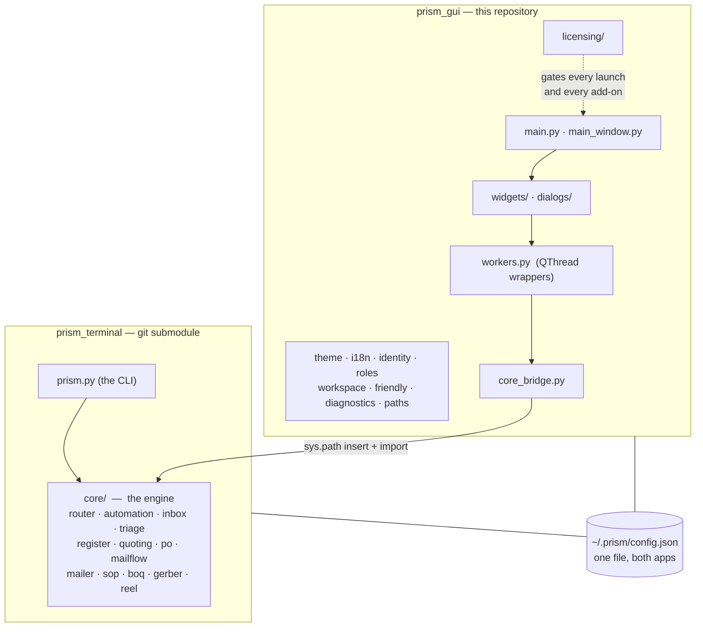
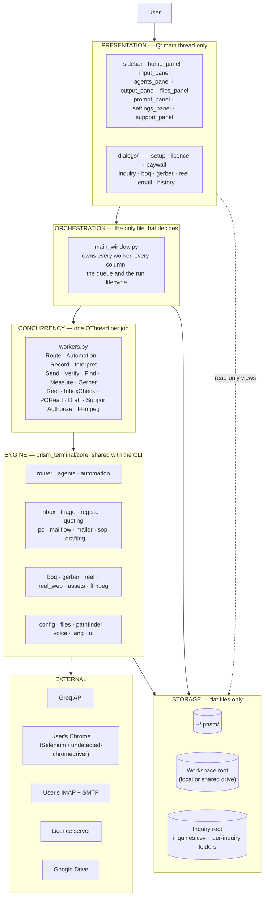
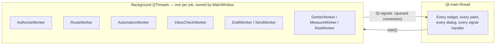
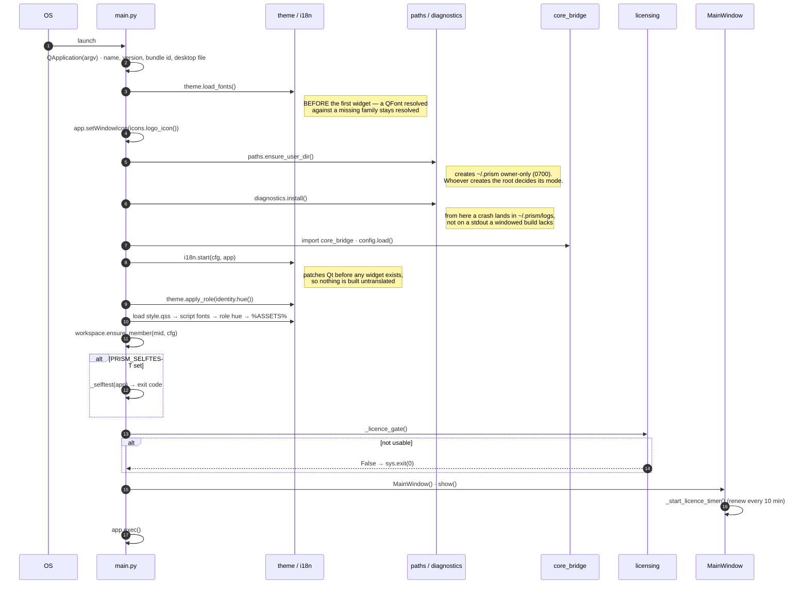

# 1 · System Overview

[← Index](README.md) · [Next: Data model →](02-data-model.md)

---

## 1.1 What Prism is, precisely

A **single-process native desktop application**, written in Python 3.12 against
PySide6 (Qt 6), shipped as a portable per-OS binary built with PyInstaller.

It has:

- **No web front end.** No Electron, no embedded browser view, no localhost
  server. Every screen is a Qt widget.
- **No backend of its own** for customer data. The only Prism-operated server is
  the **licence server**, and it never receives customer content — only a
  licence id, a device fingerprint, an app version, and usage counters.
- **No database.** All persistent state is flat files: JSON under `~/.prism`,
  and CSV in a folder the customer chooses (deliberately, so the register
  stays theirs and opens in Excel).
- **No AI model of its own.** It orchestrates other people's: Groq over HTTP for
  fast structured work, and the user's own logged-in web tools (ChatGPT,
  Claude, Perplexity, Canva, NotebookLM, Apollo…) driven through a real Chrome
  window with Selenium.

### Why that shape

The target customer is a small Indian manufacturer. Two constraints follow and
explain nearly every architectural decision:

| Constraint | Consequence in the code |
|---|---|
| **The customer's design files and correspondence must not leave their machine** | Gerber files never reach an AI (`cmd_gerber` passes `attachments=[]`, asserted by test). Triage sends only a 1,500-character snippet, and only for senders local rules could not settle. A "Keep everything on this computer" switch removes even that. |
| **The customer already pays for ChatGPT/Claude and will not pay again per token** | Automation drives the tools in *their* Chrome, signed in as them. There are no API bills for the heavy tools, and no new subscription to sell them. |

---

## 1.2 The two repositories



`prism_terminal` is pinned as a git submodule (see `.gitmodules`) to
`github.com/HitarthTrivedi/prism_terminal`.

**The submodule always wins.** `paths.resource('prism_terminal')` resolves to
`./prism_terminal` and is checked first. A sibling `../prism_terminal` checkout
is *ignored*; `core_bridge._warn_about_sibling()` prints a note naming both
paths when it finds two, because believing the opposite once cost an afternoon
spent editing a copy that was never loaded.

> **Operational trap, already recorded:** two checkouts of `prism_terminal` on
> one dev machine is a known hazard — `docs/AFTER_THE_MERGE.md` §5. Decide one
> way or the other; do not keep both.

---

## 1.3 The layer model



### The rule that keeps the layers honest

> **`main_window.py` is the only file that makes decisions.**

Widgets emit signals and render what they are given. Dialogs collect input and
return it. `workers.py` classes do one job off the UI thread and emit a result.
The engine knows nothing about Qt. Everything that decides *what happens next*
— which worker to start, what to do with its result, when to persist, when to
stop for a human — lives in `main_window.py` or in the add-on dialog that owns
that screen.

This is why `main_window.py` is 2,131 lines and why that is not, by itself, a
problem to fix. It is also why a change to behaviour almost always lands in one
file.

---

## 1.4 Process and threading model

Prism is **single-process**. Concurrency is `QThread`, never `multiprocessing`,
and never `asyncio`.



### The four rules

1. **Nothing touches a widget from a worker thread.** Workers communicate
   exclusively by Qt signal; Qt marshals the call back onto the main thread.
2. **Every worker is owned by the window that started it** and is retired in
   `closeEvent`. `MainWindow._retire_workers()` asks each live worker to stop
   and then waits up to `_WORKER_WAIT_MS = 10000` ms. `InquiryDialog.closeEvent`
   does the same for its own workers.
3. **Long-running work is interruptible, not killable.** `AutomationWorker.stop()`
   sets a flag the engine polls at safe points (`_sleep_interruptibly`,
   `should_stop` callbacks). There is no thread termination.
4. **Cleanup order matters and has bitten before.** `_retire_listener()` exists
   because dropping a wake-word listener while its thread was still running
   crashed the interpreter — see `tests/` coverage for GIL-related cleanup.

### Where blocking actually happens

| Job | Typical duration | Worker |
|---|---|---|
| Groq routing call | 1–5 s | `RouteWorker` |
| Licence authorise | up to 45 s (cold host) | `AuthorizeWorker` |
| Browser pipeline (per stage) | 35 s – 30 min | `AutomationWorker` |
| IMAP fetch + triage, one mailbox | 5 s – 3 min | `InboxCheckWorker` |
| SMTP blast | 2 s per recipient (`SEND_DELAY`) | `SendWorker` |
| Gerber measurement | 2 s – 2 min | `GerberWorker` |
| Reel encode | 1–10 min | `ReelWorker` |

---

## 1.5 Startup sequence

`main.py :: main()` — the order is load-bearing, and each step's comment in the
source explains what breaks if it moves.



### What each step protects

| Step | Moving it breaks |
|---|---|
| `theme.load_fonts()` first | Widgets built before the font is registered stay on the fallback sans forever |
| `paths.ensure_user_dir()` before `diagnostics` | `~/.prism` gets created by whatever runs first, inheriting the ambient umask instead of 0700 |
| `diagnostics.install()` before anything fallible | A crash in a windowed build has nowhere to print |
| `i18n.start()` before the first widget | Untranslated widgets, permanently |
| Stylesheet after `i18n` and `theme.apply_role` | Both rewrite the QSS; whichever runs last wins |
| Licence gate before `MainWindow` | The window reaches for the licence server during construction |

---

## 1.6 Module map

### Application root (`prism_gui/`)

| File | Lines | Responsibility |
|---|---:|---|
| `main.py` | 327 | Entry point, startup order, licence gate, `--selftest`, paywall registration |
| `main_window.py` | 2,131 | The only decision-maker: owns all workers, all three columns, the task queue, the run lifecycle, all add-on entry points |
| `core_bridge.py` | 258 | Puts `prism_terminal/core` on `sys.path`; lazy `get_*()` / `*_available()` accessors so heavy optional deps are probed, not imported at boot |
| `workers.py` | 511 | 16 `QThread` wrappers — the entire concurrency surface |
| `dashboard_data.py` | 355 | Read-only projections for Home and register screens (recent runs, counts, sparklines, register views, currency formatting) |
| `theme.py` | 597 | Industry design tokens; per-role accent hue; stylesheet rewriting |
| `i18n.py` | 441 | Interface translation; patches Qt before any widget exists; script-aware font stacks |
| `identity.py` | 191 | Who is signed in (designation key), display name, accent hue, view-as |
| `roles.py` | 211 | The eight roles, their hues, their default agent picks |
| `workspace.py` | 305 | Per-member folders on a shared drive; the team roster; read permissions |
| `plans.py` | 210 | What each plan includes — the single table the app and licence server share |
| `friendly.py` | 347 | Any error → title, plain English, numbered next steps |
| `diagnostics.py` | 300 | Crash logs to `~/.prism/logs` |
| `paths.py` | 129 | Resource resolution frozen vs. source; `~/.prism` helpers; open/reveal a result |
| `app_meta.py` | 20 | Name, version (`1.3.0`), bundle id, publisher, support email |
| `favorites.py` | 51 | Starred file/folder persistence |
| `awake.py` | — | Keep-awake during long runs |
| `cloud.py` | — | Cloud file attach |
| `wakeword.py` | — | Best-effort "Prism" wake-word polling loop (**not** a real engine — see §1.8) |
| `support_kb.py` | 1,618 | The support answer book |
| `style.qss` | 45 KB | The Industry theme — everything QSS can express |

### `widgets/` — presentation

| File | Lines | Shows |
|---|---:|---|
| `controls.py` | 1,767 | The shared component library: square switch, tool chip, step mark, pills |
| `simple_panels.py` | 1,582 | Six screens: Guide, AI tools registry, History, and three status screens |
| `output_panel.py` | 1,461 | The run console — live per-step results, Copy output, Open in tool |
| `support_panel.py` | 1,244 | Help & support: answer book left, conversation right |
| `settings_panel.py` | 1,216 | Settings as one screen with a grouped section list |
| `agents_panel.py` | 1,144 | The plan — steps, plain-English names, tool chips |
| `sidebar.py` | 1,105 | Left rail: brand, nav groups, add-on shelf with padlocks, favourites |
| `home_panel.py` | 886 | Home — the command centre |
| `input_panel.py` | 683 | The task card — the front door |
| `inquiry_panel.py` | 675 | Inquiry automation as a screen rather than a dialog |
| `tour.py` | 490 | Six-step progressive onboarding |
| `files_panel.py` | 374 | "Files you mentioned" |
| `register_table.py`, `blueprint.py`, `ask_panel.py`, `prompt_panel.py`, `icons.py`, `markdown.py` | — | Register table, hairline frame with registration marks, shared ask box, "Behind the scenes", 24×24 stroked line icons, markdown → Qt rich text |

### `dialogs/` — modal flows

| File | Lines | Flow |
|---|---:|---|
| `inquiry_dialog.py` | 2,618 | The five-tab Email automation screen, plus quotation, PO review, reminder, edit-row dialogs |
| `inquiry_setup_dialog.py` | 1,013 | Mailboxes, folders, terms, who's-who — asked once |
| `setup_dialog.py` | 1,003 | Setup, with per-section deep links from the rail |
| `email_dialog.py` | 687 | Email blast: recipients, draft, confirm-and-send |
| `reel_dialog.py` | 468 | Reel / Studio |
| `license_dialog.py` | 418 | Activation, expiry, licence problems |
| `boq_dialog.py` | 410 | Quantities off a CAD drawing |
| `history_dialog.py` | 392 | Past runs, re-rendered from stored JSON |
| `gerber_dialog.py` | — | PCB job measurement — no AI sees the design |
| `paywall.py`, `problem_dialog.py`, `guide_dialog.py`, `drive_dialog.py`, `ai_directory_dialog.py`, `completion_dialog.py`, `contact_dialog.py`, `base.py` | — | Locked-add-on pitch, friendly errors, the guide, Drive picker, tool catalogue, run completion, contact the team, shared modal chrome |

### `licensing/` — the gate

| File | Lines | Responsibility |
|---|---:|---|
| `__init__.py` | 879 | The whole public surface: `state`, `has`, `require`, `activate`, `authorize`, `refresh`, `report_usage`, `selftest` |
| `authorization.py` | 285 | The lease cache and the offline policy, in one place |
| `client.py` | 267 | HTTP to the licence server; timeouts sized for a cold host |
| `store.py` | 251 | `~/.prism/license.json`, atomic and 0600 |
| `lease.py` | 233 | Lease wire format and verification |
| `payload.py` | 186 | Server-published configuration format and verification |
| `status.py` | 169 | The state machine: none / valid / grace / stale / expired / tampered |
| `device.py` | 150 | Machine fingerprint for seat counting (three tiers) |
| `token.py` | 145 | Licence token format, signing input, verification |
| `designation.py` | 142 | The *second* key: who this person is and what job they do |
| `secretstore.py` | 132 | OS credential store, with a file fallback |
| `meter.py` | 130 | Usage metering — what was consumed, never what was written |
| `keyformat.py` | 65 | The key the customer types: `PRSM-…`, Crockford-ish alphabet, checksum |
| `keys.py` | 43 | Ed25519 public keys; DEVELOPMENT keys trusted from source only |

### `prism_terminal/core/` — the engine (18,708 lines)

| File | Lines | Responsibility |
|---|---:|---|
| `automation.py` | 3,222 | Browser automation: Chrome profile seeding, driver setup, per-stage prompt construction, typing, waiting, scraping, downloads, image harvesting, failover |
| `gerber.py` | 2,120 | RS-274X and Excellon parsing, copper geometry, track width, spacing, board outline, drills, cross-check against CAM reports |
| `reel.py` | 1,810 | Vertical video: frames drawn with Pillow, encoded with FFmpeg |
| `reel_web.py` | 1,765 | Prism Studio: the frames are a real web page filmed in a paused Chromium |
| `inbox.py` | 1,009 | IMAP: host discovery, read-only fetch, header-batching, backfill, parsing, attachments |
| `boq.py` | 827 | DXF/DWG geometry: lengths, areas, counts, per-layer and per-block |
| `router.py` | 785 | The routing brain (Groq): query enrichment, stage selection, guardrails, model fallback chain |
| `quoting.py` | 742 | Rate lists, cost sheets, matching, Decimal arithmetic, quotation rendering |
| `agents.py` | 720 | The agent registry: every tool, its URL, selectors, waits, specialty, cost |
| `mailflow.py` | 565 | The daily loop — one `check()` that never raises and never sends |
| `triage.py` | 559 | Sorting the inbox: local rules first, batched AI only for the unknown |
| `register.py` | 556 | The inquiry register CSV: numbering, threading, atomic writes, status transitions |
| `mailer.py` | 502 | SMTP: recipient parsing, discovery prompts, draft parsing, bulk send |
| `po.py` | 406 | Reading a purchase order and comparing it to the quotation |
| `sop.py` | 392 | Sending SOPs to customers at their current revision |
| `remote.py` | 328 | The LAN/relay bridge for driving Prism from a phone |
| `ffmpeg.py` | 323 | FFmpeg location, download, SHA-256 verification |
| `assets.py` | 310 | Reel assets: background cutout, ink ratio, the asset table |
| `drafting.py` | 307 | Writing the awkward emails using the browser tools |
| `ui.py`, `onboarding.py`, `pathfinder.py`, `voice.py`, `files.py`, `config.py`, `checklog.py`, `lang.py` | — | Terminal UI, CLI onboarding, natural-language file finder, push-to-talk voice, attachments, config, check logging, language |

---

## 1.7 The window layout

The window follows **direction 1b ("Workbench")** of the *Prism Directions*
design canvas, rendered in the **Industry** design system: `#f2f2f3` canvas,
slate-blue `#5980a6` accent, Barlow / Barlow Condensed, square corners,
hairline borders with blueprint registration marks.

It auto-sizes to the screen it is on: 92% / 88% of available width/height,
capped at 1360×880, floor 1060×640.

**Three fixed columns.** The old `QDockWidget`s are gone — nothing can be
dragged out, closed, or lost behind a tab, so there is no View menu.

```
┌───────────────┬───────────────────────────────┬──────────────┐
│ RAIL          │ WORK  (two-page stack)        │ CONTEXT      │
│               │                               │  (collapses  │
│ brand         │  ┌─ Composing ──────────────┐ │   to 44px)   │
│ Home          │  │ task card                │ │              │
│ How to use    │  │  · kicker, state chip    │ │ Files you    │
│ AI tools      │  │  · 16px editable task    │ │ mentioned    │
│ History       │  │  · Speak / Add file /    │ │  · Keep      │
│ Settings      │  │    Add folder / Make a   │ │  · Change    │
│ wake word     │  │    plan                  │ │              │
│               │  │ Your plan                │ │ Behind the   │
│ ADD-ONS       │  │  · one row per stage     │ │ scenes       │
│  Email autom. │  │  · include marker, icon, │ │  (collapsed) │
│  BOQ          │  │    plain-English name,   │ │  · what you  │
│  Email        │  │    tool chip             │ │    said      │
│  BOM (soon)   │  │ Start the work           │ │  · task brief│
│               │  └──────────────────────────┘ │  · each      │
│ WORKSPACE     │  ┌─ Running ────────────────┐ │    stage's   │
│  Status       │  │ live per-step cards      │ │    prompt    │
│  Login tabs   │  │  · Copy output           │ │              │
│               │  │  · Open in tool          │ │              │
│ CONFIGURE     │  │ Back to the plan         │ │              │
│  Licence …    │  └──────────────────────────┘ │              │
│               │                               │              │
│ FAVORITES     │                               │              │
└───────────────┴───────────────────────────────┴──────────────┘
```

**The accent hue shifts with the signed-in member's role**, so a glance says
whose copy this is. Only the *hue* moves — every swatch keeps its lightness, so
contrast is identical in every role and nothing needs re-checking for
legibility.

Anything not in the licence shows a **padlock** and opens the pitch rather than
failing.

---

## 1.8 Known architectural limitations

These are documented, deliberate, and should be quoted honestly to customers.
Sourced from the repo `README.md` "Known limitations" and verified in code.

| Limitation | Detail |
|---|---|
| **Wake word is best-effort** | `wakeword.py` is a polling loop — record ~2 s, check for silence, transcribe if not silent, look for "prism". Not a real local wake-word engine. Expect seconds of lag and occasional misses. Swap in Porcupine / OpenWakeWord to make it production-grade. |
| **NotebookLM automation is unverified** | `automation._run_notebooklm` is best-effort and has not been checked against a live session. |
| **Typed queries do not auto-scan for file mentions** | Only spoken input runs the interpreter. A GUI has real Attach buttons; prose-scanning a typed sentence adds risk for no benefit. |
| **Email automation's send path and PO screen have never run against a real mailbox** | Written and unit-tested. *Reading* is the well-covered half. This is the single biggest verification gap in the product. |
| **`plans.py` feature names and blurbs are not in the translation catalogue** | They render in English regardless of interface language. |
| **One machine writes the register** | Several *mailboxes* are supported; several *machines* writing one register is deliberately not built. The office PC that stays on does the writing; everyone else reads. Trigger for changing this is in `docs/DEFERRED.md`. |
| **No offline licence fallback** | If the licence server cannot be reached and no lease covers the action, the answer is no. This is a deliberate trade — see `LICENSING.md`. |

---

[← Index](README.md) · [Next: Data model →](02-data-model.md)
