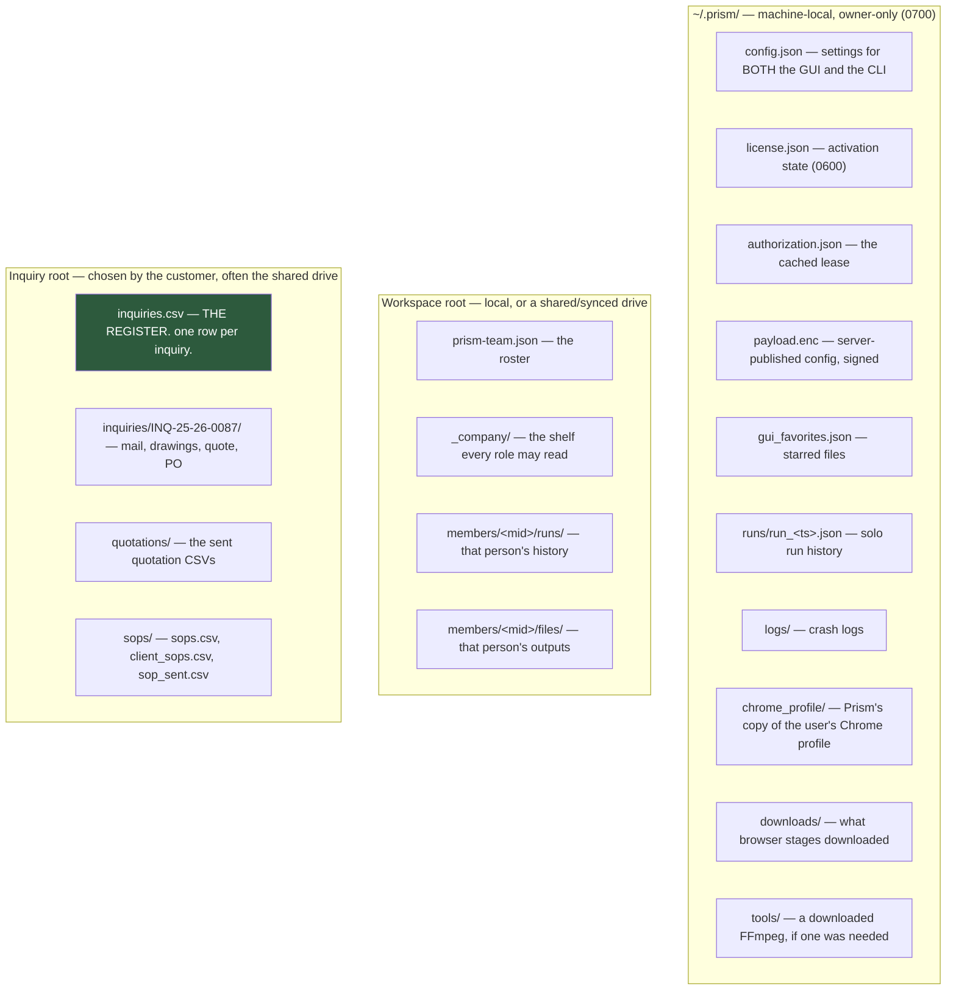
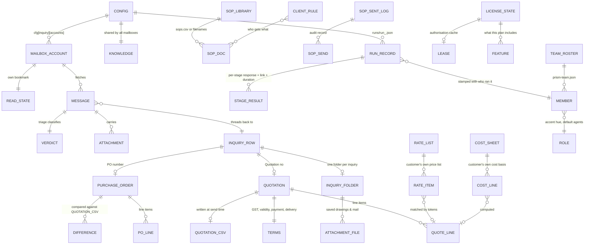
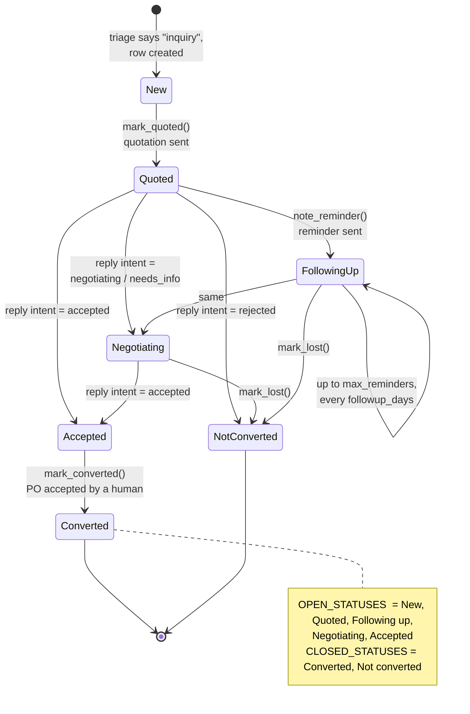

# 2 · Data Model

[← System overview](01-system-overview.md) · [Index](README.md) · [Next: Data flow →](03-data-flow.md)

---

## 2.1 The storage map

Prism has **no database**. Everything persistent is a flat file, in one of
three places.



### Why the split

| Location | Holds | Never holds |
|---|---|---|
| `~/.prism/` | Credentials, licence state, machine-local caches | Anything another machine needs |
| Workspace root | Per-member run history and outputs | Passwords — ever |
| Inquiry root | The register and everything belonging to an inquiry | Passwords — ever |

> **The rule, stated once:** mailbox and SMTP passwords live only in
> `~/.prism/config.json` on the machine that does the checking. They never
> touch the shared folder. That is why "one machine writes, everyone reads" is
> a design rule and not an accident.

---

## 2.2 Entity–relationship diagram

The register is the hub. Everything else either feeds it or hangs off it.



---

## 2.3 `~/.prism/config.json` — the shared configuration

Written by `prism_terminal/core/config.py`. **Both the GUI and the CLI read and
write this file**; set an API key in either and the other sees it immediately.

Written atomically: temp file in the same directory, `os.replace()`. A file
that fails to parse is *quarantined* (moved aside, path reported) rather than
overwritten — `config._quarantine()`.

### Root keys — engine defaults (`config.DEFAULT`)

| Key | Type | Default | Meaning |
|---|---|---|---|
| `api_key` | str | `""` | Groq API key (`gsk_…`). The only AI credential Prism holds. |
| `profile` | str | `""` | Free-text "what do you do" — steers routing |
| `agents` | dict | `{}` | `{category: agent_name}` — only categories the user enabled |
| `chrome_version` | str | `""` | Pinned Chrome major version; `""` = auto-detect |
| `chrome_profile` | str | `""` | Which real Chrome profile to copy logins from (`"Profile 20"` or an address). `""` = whichever Chrome used last. **Chrome need not have a profile called "Default"** — assuming it did meant nothing was ever copied on some machines. |
| `onboarded` | bool | `false` | Has setup been completed |
| `model` | str | `"llama-3.3-70b-versatile"` | Preferred Groq model; the fallback chain starts here |

### Additional root keys written by the GUI

| Key | Type | Meaning |
|---|---|---|
| `inbox` | dict | Single-mailbox reading credentials (legacy shape, still honoured) |
| `email` | dict | The **sending** account (SMTP) |
| `inquiry` | dict | The whole Email-automation configuration — see below |
| `workspace_root` | str | Where per-member folders live; a shared drive makes it a team |
| `output_language` | str | The language the **AI tools** answer in (separate from the interface language) |
| `language` | str | The **interface** language (`en`, `hi`, `gu`) |
| `designation` | str | The signed-in member's designation key (`PRSD1…`) |

### `cfg["inbox"]` — reading account (legacy single mailbox)

| Field | Type | Meaning |
|---|---|---|
| `address` | str | The mailbox address |
| `password` | str | App password / mailbox password — **plaintext, machine-local only** |
| `host` | str | IMAP host, discovered or typed |
| `port` | int | 993 (SSL) or STARTTLS port |
| `folder` | str | Defaults to `INBOX` |

`inbox.is_configured(cfg)` requires `address`, `password` and `host`.

### `cfg["email"]` — sending account (SMTP)

Same four fields plus port semantics: `465` → `SMTP_SSL`, otherwise STARTTLS.
`mailer.is_configured(cfg)` requires `address`, `password`, `host`.

### `cfg["inquiry"]` — the Email-automation configuration

Written whole by `dialogs/inquiry_setup_dialog.py :: _save()`.

| Key | Type | Meaning |
|---|---|---|
| `accounts` | list[dict] | **The mailbox list.** Each entry: `address`, `password`, `host`, `port`, `folder`, and its **own** `state` bookmark |
| `account` | dict | Mirror of `accounts[0]` minus `state` — kept so a config written by this version still opens in the previous one |
| `state` | dict | Mirror of `accounts[0]["state"]` — same backwards-compatibility reason |
| `folder` | str | The inquiry root. Default `~/Prism Inquiries`. Point it at a shared drive and the whole office reads one register |
| `rate_list` | str | Path to the customer's own price list (CSV or XLSX) |
| `cost_sheet` | str | Path to the customer's own cost sheet |
| `company` | str | Company name, printed on the quotation |
| `signature` | str | Email signature |
| `terms` | dict | `gst_percent`, `validity_days`, `payment`, `delivery` |
| `pricing_policy` | str | Path to the bargaining-limits file. **With no such file, the negotiation prompt is instructed to offer nothing on price at all** |
| `followup_days` | int | Days of silence before a reminder (default 2) |
| `max_reminders` | int | How many reminders before stopping (default 3) |
| `auto_minutes` | int | Automatic check interval |
| `auto_followup` | bool | Send due reminders unattended |
| `local_only` | bool | **"Keep everything on this computer"** — no message content reaches Groq at all |
| `knowledge` | dict | `own_domains`, `customers`, `vendors` (lists) and `learned` (`{address: category}`) |

> **`accounts_of(cfg)` is the one reader that understands both shapes.** It
> prefers the list; if there is no list it wraps the legacy `account` as entry
> one and carries the legacy `state` with it, so an existing customer's first
> multi-mailbox check continues from where their last single-mailbox check
> stopped instead of re-importing a month of mail.

### Read bookmark — `inbox.State`

One per mailbox. Getting this wrong either re-imports hundreds of old mails as
fresh inquiries or skips everything new forever.

| Field | Type | Meaning |
|---|---|---|
| `uidvalidity` | int | The server's folder generation. A server may **renumber** a folder (rebuild, migration) and signals it by changing this. Storing it means a renumber is *detected* instead of corrupting the register |
| `last_uid` | int | Highest UID seen — the "new mail" watermark |
| `floor_uid` | int | How far **down** the recency window this mailbox has been read. Newest mail is fetched first; older mail inside the window is backlog, worked a chunk at a time |
| `backfilled` | bool | Set once a backlog search comes back empty, so the steady state costs one SEARCH and nothing else |

> **Why `floor_uid` exists:** without it, a first check on a busy mailbox handed
> back the *oldest* 200 of 766 messages — three minutes of waiting to be shown a
> month-old newsletter, with the real inquiries four checks away.

---

## 2.4 The inquiry register — `inquiries.csv`

**The single most important artefact in the product.** An ordinary CSV that
opens in Excel and stays the customer's whatever happens to Prism.

Defined in `prism_terminal/core/register.py`. Written atomically. Hand-added
columns survive a rewrite. A register open in Excel produces the sentence
"close it in Excel" (`RegisterLocked`), not a lost row.

### Columns, in file order

| # | Column | Written by | Notes |
|---:|---|---|---|
| 1 | `Inquiry no` | `next_number()` | `INQ/25-26/0087` — prefix / financial year / zero-padded serial |
| 2 | `Date received` | `from_message()` | From the message date |
| 3 | `Time received` | `_clock()` | **Time as well as date.** Two inquiries from one customer on one morning are indistinguishable in a date-only register, and "which came first" is exactly the question asked when someone revises their requirement an hour later |
| 4 | `Customer` | Groq details extraction | |
| 5 | `Contact person` | Groq details extraction | |
| 6 | `Email` | Message sender | |
| 7 | `Phone` | Groq details extraction | |
| 8 | `Product asked` | `product_summary()` | Also used to match a rate list |
| 9 | `Quantity` | Groq details extraction | |
| 10 | `Drawing` | Attachment save | Filename(s) filed into the inquiry folder |
| 11 | `Status` | Lifecycle | See the state machine below |
| 12 | `Quotation no` | `mark_quoted()` | `QTN/25-26/0042` |
| 13 | `Quotation date` | `mark_quoted()` | |
| 14 | `Quotation value` | `mark_quoted()` | Indian lakh grouping |
| 15 | `Reminders sent` | `note_reminder()` | Counter, capped by `max_reminders` |
| 16 | `Last contact` | Several | |
| 17 | `Result` | `mark_converted()` / `mark_lost()` | |
| 18 | `Reason if lost` | `mark_lost()` | |
| 19 | `PO number` | `mark_converted()` | |
| 20 | `PO date` | `mark_converted()` | |
| 21 | `Order value` | `mark_converted()` | |
| 22 | `Folder` | `from_message()` | Path to this inquiry's folder |
| 23 | `Notes` | Various | |
| 24 | `Thread` | `add_thread()` | **Not for reading.** `Message-ID` / `References` identifiers that tie a reply back to its row. This is what stops one conversation becoming four rows |
| + | `Mailbox` | `_stamp_mailboxes()` | Which address the inquiry arrived at. Added when several mailboxes feed one register |

### Status lifecycle



`REPLY_STATUS` maps the reply intent onto the status: `accepted → Accepted`,
`rejected → Not converted`, `negotiating → Negotiating`,
`needs_info → Negotiating`.

### Numbering

`fy_label()` returns `"25-26"` for any date from 1 April 2025 to 31 March 2026 —
the Indian financial year. `next_number(rows, prefix, when)` reads the existing
`Inquiry no` column, finds the highest serial **in the current financial year**,
and returns the next. An imported register therefore carries on from the
customer's own numbering rather than restarting.

### Threading — how a reply finds its row

`thread_key(message)` collects `Message-ID`, `In-Reply-To` and `References`.
`find_by_thread(rows, message)` matches **by conversation first, then by
sender**. `add_thread(row, message)` folds new identifiers into the row without
losing the old ones.

---

## 2.5 The inquiry folder

`mailflow.Paths.folder_for("INQ/25-26/0087")` →
`<root>/inquiries/INQ-25-26-0087/`

The number carries slashes and a slash in a path is a directory separator, so
it becomes hyphens on disk. Reversible by eye, which is what matters when
somebody is looking for it.

```
<inquiry root>/
├── inquiries.csv                      ← THE REGISTER
├── inquiries/
│   └── INQ-25-26-0087/
│       ├── <saved attachments>        ← drawings, specs (safe_name()d)
│       └── <the mail itself>
├── quotations/
│   └── QTN-25-26-0042.csv             ← written AT SEND TIME
└── sops/
    ├── sops.csv                       ← the library index
    ├── client_sops.csv                ← who gets what
    └── sop_sent.csv                   ← the audit log
```

`inbox.safe_name(name, fallback)` strips `[<>:"/\|?*\x00-\x1f]` so an
attachment filename cannot escape its folder or upset Windows.

---

## 2.6 Quotation

### In memory

**`Terms`** — from `cfg["inquiry"]["terms"]`

| Field | Type | Default |
|---|---|---|
| `gst_percent` | Decimal | 18 |
| `freight` | Decimal | 0 |
| `discount_percent` | Decimal | 0 |
| `validity_days` | int | 15 |
| `payment` | str | `"100% against proforma invoice"` |
| `delivery` | str | `"2–3 weeks from receipt of confirmed order"` |
| `currency` | str | `"INR"` |
| `notes` | str | `""` |

**`QuoteLine`**

| Field | Type | Meaning |
|---|---|---|
| `description` | str | |
| `quantity` | Decimal | |
| `unit` | str | `"nos"` |
| `rate` | Decimal | |
| `hsn` | str | HSN tax code |
| `basis` | str | **Where the rate came from** — `"rate list"`, `"cost sheet"`, `"entered by hand"`. Printed on the internal copy so any figure can be traced later |
| `amount` | property | `rupees(rate × quantity)` |

**`Quotation`** — `number`, `date`, `customer`, `contact`, `email`,
`inquiry_no`, `lines[]`, `terms`, `breakdown`.

Every total is a **property**, in one place, so the arithmetic cannot disagree
with itself:

```
subtotal  = Σ line.amount
discount  = subtotal × discount_percent / 100
taxable   = subtotal − discount + freight
gst       = taxable × gst_percent / 100
total     = taxable + gst
valid_until = date + validity_days
```

> **No AI ever touches a figure.** All arithmetic is `Decimal` with
> `ROUND_HALF_UP` (`quoting.rupees()`) — the way an invoice rounds, never
> banker's rounding. `indian_currency()` renders `1,42,500.00` with lakh
> grouping, which is what the reader expects to see.

### On disk — `quotations/<number>.csv`

Written by `quoting.write_csv()` in `utf-8-sig` (so Excel opens it correctly).

```
Quotation no , QTN/25-26/0042
Date         , 14-08-2026
Customer     , <name>
Inquiry no   , INQ/25-26/0087
(blank)
Sr | Description | HSN | Quantity | Unit | Rate | Amount | Rate source
 1 | …           | …   | …        | nos  | …    | …      | rate list
(blank)
                                        Subtotal  | …
                                        Discount% | -…      (if any)
                                        Freight   | …       (if any)
                                        GST 18%   | …
                                        Total     | …
```

> **This file is load-bearing.** It is what the PO comparison reads back — "the
> quotation actually sent", not a re-derivation. The comparison is *refused* on
> any mismatch.

---

## 2.7 Purchase order

**`POLine`** — `description`, `quantity`, `unit`, `rate`, `amount`.

`settled()` fills in whichever of `quantity × rate = amount` was left out. POs
routinely print only two of the three. **Derived by arithmetic only, never by
asking a model to work it out.**

**`PurchaseOrder`**

| Field | Type | Meaning |
|---|---|---|
| `number` | str | |
| `date` | date | |
| `buyer` | str | |
| `lines` | list[POLine] | |
| `delivery_date` | date | |
| `total` | Decimal | The **printed** total |
| `terms` | str | |
| `reference` | str | Our quotation number, when they quote it |
| `source` | str | The file it was read from |
| `computed_total` | property | Σ line.amount |
| `value` | property | **Printed total wins**, else the sum of lines — the printed one may legitimately include freight or tax the lines do not, and it is the figure both sides will quote at each other later |
| `missing()` | method | Fields a person must still supply — this drives the form Prism shows |

**`Difference`** — one row of the comparison. Kind is `MONEY` or `NOTE`.

> **The rate-gap rule:** a rate difference is measured **in money, multiplied
> out by quantity**. Ninety paise on five thousand pieces is ₹4,500 walking
> past a one-rupee tolerance.

---

## 2.8 Pricing inputs — the customer's own files

### Rate list (`cfg["inquiry"]["rate_list"]`) → `RateItem`

CSV or XLSX (needs `openpyxl`). `load_rates()` finds the header row by scanning
for one that names a description **and** a rate, then maps columns through
`_COLUMN_ALIASES` — `code`/`item code`/`sku`/`part no`/`cat no`/…, and similar
alias sets for description, rate, unit, HSN.

Extra columns like `Rate @ 100` become **quantity slabs**
(`_SLAB_HEADER`). `RateItem.rate_for(quantity)` returns the deepest slab
reached.

**Matching** is `match_item(query, items)`: tokenise (`tokens()` — words and
numbers, lowercased, polite noise removed via `_STOPWORDS`), score, return the
best five with a **`reason`** for each, in the owner's own words, shown next to
every match. `is_confident(matches, margin=1.6)` is true only when the best row
is clearly ahead of the runner-up.

`RateFileError` always carries the fix in its text.

### Cost sheet (`cfg["inquiry"]["cost_sheet"]`) → `CostLine`

The owner's own cost basis: name, basis, rate. Basis is one of
`per_kg` · `per_piece` · `per_lot` · `percent`.

`cost_sheet(lines, weight_kg, quantity)` runs it for one job and returns a
`CostBreakdown`. **Shown, never hidden** — every line of the working appears on
screen.

Weight helpers, for spring manufacturers specifically:

| Function | Computes |
|---|---|
| `density_for(material)` | kg/m³ from `DENSITY_KG_PER_M3` (steel 7850, stainless 7930, brass…) |
| `wire_weight_kg(dia, length, material)` | Weight of a length of round wire or bar |
| `coil_length_mm(mean_dia, total_coils)` | π × mean diameter × coils |
| `spring_wire_weight_kg(wire_dia, outer_dia, total_coils, material)` | Weight of one helical spring, from the three numbers on the drawing |

---

## 2.9 Mail records (in memory only)

**`Message`** — `prism_terminal/core/inbox.py`

| Field | Type | Purpose |
|---|---|---|
| `uid`, `message_id`, `date` | | Identity and ordering |
| `from_name`, `from_addr`, `to[]` | | Who |
| `subject`, `body` | | Content |
| `attachments[]` | list[Attachment] | `name`, `mime`, `data`, `size` |
| `in_reply_to`, `references[]` | | **Thread link** — what stops one conversation becoming four rows |
| `list_unsubscribe`, `auto_submitted`, `precedence` | | The famous bulk markers |
| `list_id`, `list_help`, `feedback_id` | | The less famous ones. Atlassian notifications carry `List-Help` and a Salesforce Marketing Cloud `Feedback-ID` and **no unsubscribe header at all** — they were the only mail in a real 40-message sample the rules could not place, and one ended up in the register as a customer inquiry |
| `headers_only` | bool | True when only headers were downloaded. Mail that says in its own headers that it is a mailshot is settled without a body, so the body never crosses the wire — that is most of what a real inbox contains, and it is where the three minutes went |
| `sender_domain` | property | |
| `snippet(limit=1500)` | method | Subject plus the opening of the body — **what triage shows an AI, and deliberately short**: the less of somebody's correspondence that leaves the building, the more honestly we can describe what Prism does with it |

**`Verdict`** — `category`, `source`, `reason`, `is_reply`, `actionable`.

`source` is `"rule"` · `"learned"` · `"ai"` · `"none"` — **shown in the UI**, so
a wrong answer can be traced to the thing that produced it instead of blamed on
"the AI".

Categories: `inquiry` · `order` · `payment` · `promotion` · `vendor` ·
`internal` · `other` · `unsorted`. Only `inquiry` and `order` are
`ACTIONABLE`, and only those two are worth an AI call when the rules are
unsure.

**`Knowledge`** — persisted in `cfg["inquiry"]["knowledge"]`.

| Field | Type | Meaning |
|---|---|---|
| `own_domains` | set | The company's own domains |
| `customers` | set | Addresses or domains |
| `vendors` | set | Addresses or domains |
| `learned` | dict | `address → category`, grown from corrections |

> Every field here makes the rules smarter and the AI less necessary — which is
> both cheaper and more private. `learn()` remembers a correction, and **that
> sender is never sent to an AI again**. Shared across every mailbox on
> purpose: a sender is the same sender whichever address they wrote to.

**`mailflow.Item`** — one thing that came out of a check and may need a person:
`kind` (`inquiry` · `reply` · `order` · `sop`), `message`, `row`, `folder`,
`files[]`, `intent`, `note`.

**`mailflow.Result`** — `counts`, `sorted_mail[(Message, Verdict)]`,
`new_inquiries[]`, `replies[]`, `orders[]`, `followups[]`, `sops[]`, `state`,
`knowledge`, `error`, `fetched`.

> `unsorted_by_failure` is kept apart from ordinary unsorted mail. One means
> "we read it and it is unclear"; the other means "we never got to read it at
> all", **and only the second is a reason to go and look yourself**. A real
> inquiry was lost inside the first meaning once, which is why it has a name.

---

## 2.10 SOP records

| Entity | Source | Fields |
|---|---|---|
| `SopDoc` | `sops.csv`, else filenames | code, title, revision, path, applies-to, date; `newer_than(revision)` |
| `ClientRule` | `client_sops.csv` | which customers receive which documents; `matches(address)` |
| Send log | `sop_sent.csv` | `Date sent`, `Customer`, `Email`, `SOP code`, `Title`, `Revision`, `Reason`, `Inquiry no` |
| `Pending` | computed | what should go out now, **with the reason for each** |

Revision is parsed from `_REVISION` (`_rev2`, `-v1.1`, `(R3)`) and code from
`_CODE`. The log is written atomically like the register — it is an audit
record.

---

## 2.11 Run history — `runs/run_<ts>.json`

Written by `config.save_run(record, runs_dir)`. The GUI passes a **per-member**
folder (`workspace.runs_dir(mid, cfg)`) so one person's history does not land in
another's; the CLI writes to `~/.prism/runs`.

| Key | Type | Meaning |
|---|---|---|
| `query` | str | The user's own words |
| `routing` | dict | `{stage: {questions, needed}}` — what the router decided |
| `responses` | dict | `{stage: [text, …]}` |
| `links` | dict | `{stage: url}` — where the work is |
| `attachments` | list[str] | Names, not dicts — matches what the CLI writes |
| `agents` | dict | **GUI only:** which tool actually ran each step, so History can name them instead of showing bare stage keys |
| `durations` | dict | **GUI only:** how long each step took. The panel had timed every stage all along and the number died with the widget — which is why "this one is slow" was never answerable |
| `error` | str | Present only on a failed run |
| `member` | dict | `{mid, name, role}` — stamped so a run file is self-describing even if copied out of its folder |

> `member` is always the **real** member, never `identity.viewing()`. An admin
> reading someone else's profile and then starting a run files that run under
> themselves.

---

## 2.12 Team and identity

**`prism-team.json`** at the workspace root: `[{mid, name, role}, …]`.

`workspace.member_id(role, name)` builds the stable folder name — **role
first**, so an `ls` of the members directory groups by job.

| Path | Holds |
|---|---|
| `<root>/prism-team.json` | The roster |
| `<root>/_company/` | The shared shelf every role may read |
| `<root>/members/<mid>/runs/` | That member's history |
| `<root>/members/<mid>/files/` | That member's outputs |

`SOLO = "personal"` is the member id for a single-user copy that has not been
pointed at a shared workspace.

**Roles** (`roles.py`): `owner` · `manager` · `sales` · `marketing` ·
`operations` · `engineering` · `accounts` · `hr`. Each carries an accent hue;
`GENERAL_HUE = 210` is Prism's own, used for anyone without a role.
`roles.default_agents(key, available)` picks one tool per stage that role uses.

---

## 2.13 Licence state

Full treatment in [05-licensing.md](05-licensing.md); the storage shape is here.

| File | Mode | Holds |
|---|---|---|
| `~/.prism/license.json` | 0600, atomic | Activation state: token, licence id, cached claims, clock high-water mark |
| `~/.prism/authorization.json` | 0600 | The cached lease, plus the last failed-attempt timestamp for `RETRY_INTERVAL` throttling |
| `~/.prism/payload.enc` | 0600 | The server-published configuration blob, verbatim and signed |
| OS credential store | — | The reusable licence key, when the machine has one (`secretstore.py`, service `"Prism (Alphakore)"`). Falls back to the file |

**`LicenseState`** — `usable()`, `days_left()` (rounded **up**), `has(feature)`.
Statuses: `none` · `valid` · `grace` · `stale` · `expired` · `tampered`.
`CLOCK_TOLERANCE = 1 day`; `clock_rolled_back()` compares against the stored
high-water mark.

**`Lease`** — a verified authorisation grant, constructed only from claims that
passed `lease.verify()`. States: `NONE` · `FRESH` · `GRACE` · `STALE` ·
`TAMPERED`. Scopes: `core` · `workflow` · `grok`.

---

## 2.14 Data classification — what leaves the machine

The single table to hand a customer who asks "where does my data go".

| Data | Leaves the machine? | To where | Controlled by |
|---|---|---|---|
| Mailbox / SMTP passwords | **Never** | — | Stored in `~/.prism/config.json` only |
| Full email bodies | **Never** | — | Only a ≤1,500-char snippet, and only for unsettled senders |
| Email snippets (unknown senders only) | Yes, conditionally | Groq | `local_only` switch removes even this |
| Inquiry details extraction | Yes | Groq | `local_only` |
| Purchase-order text | Yes | Groq | `local_only` → typed-in boxes instead |
| **Gerber / PCB design files** | **Never — hard rule** | — | `cmd_gerber` passes `attachments=[]`; asserted by test |
| CAD drawings (BOQ) | Yes | The browser tools the user chose | `write_files = [cad_file] + templates + note_files` — **deliberately different from Gerber**; see `docs/AFTER_THE_MERGE.md` §2 |
| Quotation figures | **Never to an AI** | — | All arithmetic is Python `Decimal` |
| The register | Never | — | Local or the customer's own shared drive |
| Task text and attachments (main pipeline) | Yes | The user's own logged-in tools, in their own Chrome | The user picks the tools |
| Licence id, device fingerprint, app version, usage counters | Yes | Licence server | Unavoidable — this is the licence check |
| Email content, customer names, file contents | **Never** to the licence server | — | `meter.py` records *what was consumed, never what was written* |

---

[← System overview](01-system-overview.md) · [Index](README.md) · [Next: Data flow →](03-data-flow.md)
