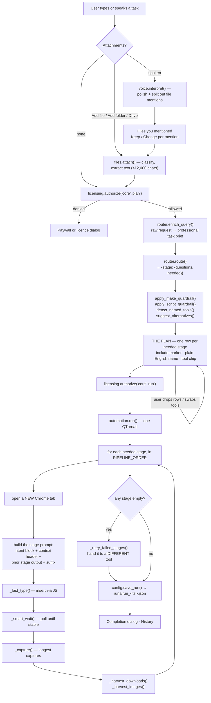
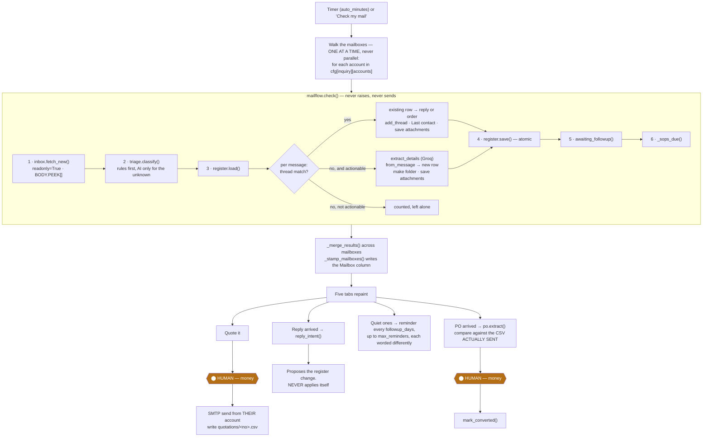
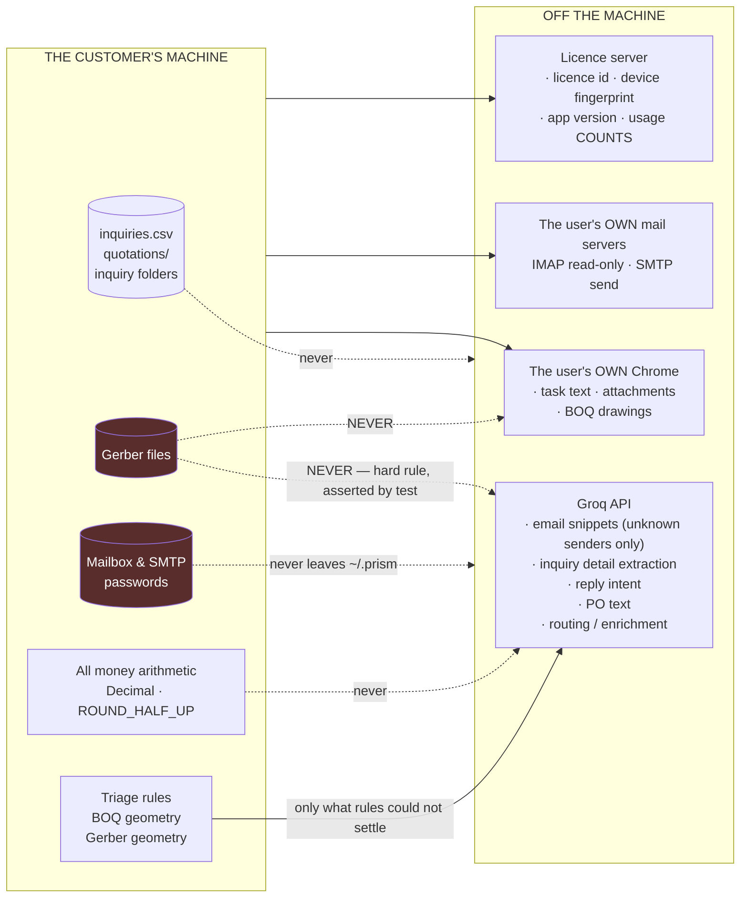

# 3 · Data Flow — every stage, input and output

[← Data model](02-data-model.md) · [Index](README.md) · [Next: API reference →](04-api-reference.md)

---

## 3.0 How to read this document

Prism runs **six independent pipelines**. They share configuration and the
licence gate; they do not share state with each other.

| # | Pipeline | Entry point | Human stops |
|---|---|---|---|
| A | [Main task pipeline](#31-pipeline-a--the-main-task-pipeline) | The task card → Make a plan → Start the work | Reviewing the plan |
| B | [Email automation daily loop](#32-pipeline-b--email-automation-the-daily-loop) | Check my mail (manual or timer) | **Sending a quotation · Accepting a PO** |
| C | [BOQ](#33-pipeline-c--boq-quantities-off-a-drawing) | BOQ add-on | Pricing (deliberately left blank) |
| D | [Gerber](#34-pipeline-d--gerber-pcb-measurement) | Gerber add-on | None — pure measurement |
| E | [Reel / Studio](#35-pipeline-e--reel--studio) | Reel add-on | None |
| F | [Email blast](#36-pipeline-f--email-blast) | Email add-on | **Confirm and send** |

Every stage table uses the same four columns: **Input → Process → Output →
Lands in**. Where a stage can send data off the machine, it is marked **⚠ leaves
the machine**.

---

## 3.1 Pipeline A — the main task pipeline

The general-purpose one: a task in plain language becomes a chain of AI tools
driven in the user's own Chrome.

### Stage A1 — Capture the task

| | |
|---|---|
| **Input** | Typed text in the task card, **or** microphone audio (push-to-talk / wake word) |
| **Process** | Typed: taken verbatim. Spoken: `RecordWorker` captures WAV at 16 kHz → `voice.transcribe()` (Groq `whisper-large-v3`) → `voice.interpret()` polishes the transcript and splits out file mentions ⚠ **leaves the machine** |
| **Output** | `query: str`, plus `{"mentions": [...]}` for spoken input |
| **Lands in** | `MainWindow._last_query`, the task card |

> **Typed queries are deliberately not prose-scanned for file mentions.** Only
> spoken input runs the interpreter — a GUI has real Attach buttons, and
> scanning a typed sentence adds risk for no benefit.

### Stage A2 — Resolve file mentions (spoken input only)

| | |
|---|---|
| **Input** | Each mention string, e.g. "the quotation on my desktop" |
| **Process** | `pathfinder.find(desc, cfg)` — `_llm_parse` (Groq) or `_heuristic_parse` fallback → candidate dirs (`_KNOWN_ROOTS`, depth ≤ 2, `_MAX_WALK_ENTRIES = 4000`) → fuzzy filename match (depth ≤ 3) |
| **Output** | `{folders: [...], files: [...]}`, ≤ 5 matches |
| **Lands in** | The **Files you mentioned** rail, one row per mention with **Keep** / **Change** — the GUI equivalent of the CLI's confirm-before-attach |

### Stage A3 — Attach files

| | |
|---|---|
| **Input** | A path from Add file / Add folder / the Drive picker |
| **Process** | `files.attach(path)` classifies by extension, extracts text where it can (≤ `MAX_TEXT_CHARS = 12000`). `files.attach_dir()` takes plain files directly inside a folder, capped at `MAX_DIR_FILES = 15` |
| **Output** | Attachment records: `{name, path, kind, size, text}` |
| **Lands in** | `MainWindow.attachments`; `files.context_block()` injects contents inline into agent prompts; `files.routing_note()` gives the router a short note only |

### Stage A4 — Licence authorisation

| | |
|---|---|
| **Input** | `feature="core"`, `action="plan"` |
| **Process** | `AuthorizeWorker` → `licensing.authorize()` → `client.authorize()` (45 s timeout, 1 retry) ⚠ **leaves the machine** — licence id, device fingerprint, app version, action, feature, scopes. **No customer content.** |
| **Output** | `Authorization(allowed, run_id, message, code, state, offline)` |
| **Lands in** | Gate: allowed → continue; denied → paywall or licence dialog |

### Stage A5 — Enrich the query

| | |
|---|---|
| **Input** | Raw query + `cfg["profile"]` + API key + model |
| **Process** | `router.enrich_query()` — a Groq pre-pass that expands the raw request into a professional task brief ⚠ **leaves the machine** |
| **Output** | `brief: str` |
| **Lands in** | The routing prompt, and **Behind the scenes** in the context rail |

### Stage A6 — Route

| | |
|---|---|
| **Input** | query, brief, `cfg["profile"]`, active agents, attachment note, premium flags |
| **Process** | `router.route()` → `groq_chat()` against the model chain (`cfg["model"]` first, then `MODEL_FALLBACKS`: `openai/gpt-oss-120b`, `openai/gpt-oss-20b`, `groq/compound-mini`). Retries on 429/500/502/503/504. A fallback that works is **remembered** into `cfg["model"]` |
| **Output** | `{stage: {"questions": [...], "needed": bool}}` for each of the ten stages |
| **Lands in** | `MainWindow.routing`; rendered as the plan |

**The ten stages, in `PIPELINE_ORDER`:**
`research` → `leads` → `brains` → `content` → `visual` → `media` → `audio` →
`development` → `presentation` → `summary`

### Stage A7 — Guardrails and alternatives

| Guardrail | What it forces |
|---|---|
| `apply_make_guardrail()` | If the user clearly asked to *make* an artefact (slide deck, image, video, web app), that stage is forced on even if the router said no |
| `apply_script_guardrail()` | A reel/video/deck needs **words** — script, narration, captions, slide copy. Forces a writing stage |
| `detect_named_tools()` | A tool the user *named* ("using NotebookLM…") is pre-selected and tagged **You picked this** |
| `suggest_alternatives()` | For each needed stage, offers other tools that could do it. The router's suggestion is **starred** in the chip's menu |

### Stage A8 — The plan (human review)

| | |
|---|---|
| **Input** | The routing dict + guardrail results |
| **Process** | `widgets/agents_panel.py` renders one row per needed stage: square include-marker, line icon, plain-English name ("Look things up", "Write it up", "Build the slides"), one line of what it means, and the tool as a clickable **chip** |
| **Output** | `run_agents` — whatever is still switched on |
| **Lands in** | `automation.run()` |

### Stage A9 — Execute the pipeline

Runs on `AutomationWorker`. For each needed stage:

| Step | Input | Process | Output |
|---|---|---|---|
| Driver | `cfg["chrome_version"]`, `cfg["chrome_profile"]` | `_setup_chrome_driver()` — undetected-chromedriver against `~/.prism/chrome_profile`. `seed_profile()` copies the real Chrome profile in (so the user is already signed in). `_clear_profile_locks()` removes `SingletonLock` left by a killed run. `_prune_preferences()` stops Prism poisoning its own profile | A live driver |
| Tab | agent name | `_open_tab()` — a **new** tab, leaving every finished one on screen | |
| Prompt | query, prior stage output, agent config | `_intent_block()` (the user's own words, verbatim, at the top of every stage prompt) + `_context_header()` + prior output + `_resolve_suffix()` | The full prompt text |
| Type | prompt | `_fast_type()` inserts the whole prompt at once via JavaScript rather than per-character; `_bmp_safe()` strips non-BMP characters ChromeDriver refuses | |
| Wait | agent config | `_smart_wait()` — poll every 5 s, require `stable_for=25 s`, `min_wait=35 s`, cap from the registry (`WAIT_FLOOR=300`, `WAIT_MULTIPLIER=2.0`, `WAIT_CEILING=1800`). Interruptible | `(waited, timed_out)` |
| Health | page | `_looks_signed_out()` · `_looks_exhausted()` · `_looks_unreadable()` — each returns `""` when fine, else the sentence the user needs | |
| Scrape | page | `_capture()` — everything reading as a reply, longest captures only. `_is_prompt_echo()` rejects the tool echoing the prompt back | `[text, …]` |
| Harvest | download folder, page | `_wait_for_downloads()` (45 s), `_harvest_downloads()` → attachment records the next stage can use. `_harvest_images()` pulls real generated images, since an image cannot travel in a text handoff | Files, images |

⚠ **This whole stage runs in the user's own browser, signed in as them.** The
prompt and any attached files go to whichever tools the user chose.

### Stage A10 — Failover

| | |
|---|---|
| **Input** | Any stage whose output came back empty |
| **Process** | `_retry_failed_stages()` — hands each failed stage to a **different** tool via `agents.alternatives_for()` |
| **Output** | Filled-in responses where a second tool succeeded |

### Stage A11 — Persist

| | |
|---|---|
| **Input** | responses, links, stage agents, durations, attachments, routing, query |
| **Process** | `config.save_run(record, workspace.runs_dir(mid, cfg))` |
| **Output** | `runs/run_<timestamp>.json` |
| **Lands in** | History dialog; Home's recent-runs list via `dashboard_data.recent_runs()` |

> A failed run has no engine return value, so `_save_run` rebuilds what did land
> from the per-stage events collected on the way. Save failures are swallowed to
> the status bar on purpose: **the run itself succeeded, and a full disk should
> not turn that into an error dialog.**

---

## 3.2 Pipeline B — Email automation, the daily loop

The one used every day, and the reason the app gets opened at all.

**Five tabs, in the order the work happens:**
What arrived → Inquiries → What they said back → Waiting on a reply → The order came.

### B.0 The whole loop

### B.1 Fetch — `inbox.fetch_new()`

| | |
|---|---|
| **Input** | `cfg` (one account), its `State` bookmark, `always_full` (known senders), `must_read` (predicate), `catch_up_with_new` |
| **Process** | IMAP connect (SSL 993, else STARTTLS) → `select(folder, readonly=True)` → check `UIDVALIDITY` against the bookmark → `_search_above(last_uid)` for new mail, plus `_search_window(first_days)` for backlog → `_fetch_headers()` in batches of `HEADER_BATCH = 100` → bodies pulled **only** for messages that might matter, with `BODY.PEEK[]` |
| **Output** | `(messages: list[Message], new_state: State, error: str)` |
| **Lands in** | Memory only. Nothing is written to the mailbox |

**Limits:** `FIRST_FETCH_DAYS = 30` · `MAX_PER_FETCH = 200` ·
`MAX_BODY_CHARS = 20000` · `BACKFILL_PER_CHECK = 60`.

> **Reads the mailboxes, never writes to them.** `readonly=True` on select and
> `BODY.PEEK[]` on fetch mean nothing is marked read, moved or deleted — the
> owner keeps using Outlook on the same account.

**Which bodies get downloaded:**

| Case | Body fetched? | Why |
|---|---|---|
| Headers say it is a mailshot (`says_it_is_bulk`) | No | That is most of what a real inbox contains, and where three minutes went |
| Sender is known (`always_full`) | **Yes, always** | A customer on a system that stamps an unsubscribe link onto every message must not be caught by the bulk rule. Being over-generous costs one body download; being mean costs an order |
| Subject asks for a price, or names a PO (`must_read`) | **Yes, whatever the headers say** | Subjects arrive with the headers, so this costs nothing, and it is the difference between "we never downloaded it" and a lost order |
| Otherwise | Yes | |

### B.2 Sort — `triage.classify()`

Two passes: local rules, then one batched AI call for whatever is left.

| Pass | Input | Process | Output |
|---|---|---|---|
| **Rules** | `Message`, `Knowledge` | `rules_pass()` — `List-Unsubscribe` / `List-Id` / `List-Help` / `Feedback-ID` / `Precedence` / `Auto-Submitted`; robot addresses (`no-reply@`, `mailer-daemon@`…); learned corrections; known customers and vendors; own domains; narrow keyword sets (`_PO_WORDS`, `_PAY_WORDS`, `_INQ_WORDS`, `_PROMO_WORDS`, `_INQ_SUBJECT`, `_INQ_BODY`, `_OFFERING`, `_ORDER_PHRASES`) | `Verdict(category, source="rule"\|"learned", reason)` — or `UNSORTED` with `source="none"`, meaning "ask" |
| **AI** | Only the unsettled messages, batched `batch_size=10` | `defang()` strips the message's power to imitate the prompt carrying it, then one Groq call on model `FAST_MODEL = llama-3.1-8b-instant` ⚠ **leaves the machine** — subject + ≤1,500 chars of body, per unknown sender only | `Verdict(category, source="ai")`, or `source="failed"` if the model never answered |

**`local_only=True` sets `api_key = ""` for the entire check**, not just triage.

> That is deliberate and was a fix: `local_only` was passed to triage alone at
> first, which left detail extraction and reply reading still sending customer
> correspondence out. **A privacy switch that quietly did two thirds of what its
> name promises is worse than not offering one.**

**Prompt-injection defence:** `defang()` neutralises `_FORGED_FENCE` (a message
faking "--- END EMAIL ---") and `_FORGED_ANSWER` (a message writing its own
"3: inquiry" answer line).

### B.3 Register — the ordering rule

For every message, **thread first, verdict second**:

| Case | Action | Result item |
|---|---|---|
| Thread matches an existing row | `add_thread()` · `Last contact` = today · save attachments into the existing folder | `Item("order")` if category is ORDER, else `Item("reply")` with `intent` |
| No thread match, **not** actionable | Counted and left alone | — |
| No thread match, actionable | `extract_details()` (Groq ⚠) → `from_message()` → new row → **make the folder even if nothing was attached** → save attachments → `Drawing` column | `Item("inquiry")`, or `Item("order")` noted "ordered without a quotation from us" |

> **Why thread beats verdict:** a message belonging to an inquiry already in the
> register is live business by definition. It used to get a vote — "Yes, please
> proceed" from a customer whose address had never been added to the customer
> list reads like nothing in particular, so it came back unsorted, unsorted is
> not actionable, and the loop skipped it before ever asking which quotation it
> answered. **A whole negotiation could go quiet that way, and the register
> would still say "waiting on a reply".**

> **Why the folder is made even when empty:** the register points at that folder
> from the moment the row exists, and the quotation and the PO land in it later.
> A path in the file that opens onto nothing is the kind of small broken thing
> that makes people stop trusting the rest.

### B.4 Save — atomic, and honest about locks

`register.save(rows, path)` writes to a temp file in the same directory and
`os.replace()`s it. Hand-added columns survive.

If Excel holds the file open, `RegisterLocked` is raised with a plain sentence.
`check()` then returns with `out.error` set **and the bookmark reset to the
previous state** — the work is in memory, only the write failed, and nothing is
lost because unsaved rows have no bookmark advance behind them.

### B.5 The multi-mailbox walk

Owned by `InquiryDialog`, not by the engine.

| Rule | Behaviour | Why |
|---|---|---|
| One at a time, never parallel | `_check_account()` → `_account_checked()` → next | Every account's rows land in the same CSV, and two writers racing on one order book is how a row is lost |
| One dead mail server | **Skipped**; the walk continues | That account's problem; the others carry on |
| One locked register | **Stops the whole walk** | The same lock would refuse every account after it, and no bookmark has moved |
| Bookmarks | `_remember_account()` banks each mailbox's own `state` | Two mailboxes sharing one bookmark would skip or re-import each other's mail |
| Learned corrections | Shared across all mailboxes | A sender is the same sender whichever address they wrote to |
| `Mailbox` column | `_stamp_mailboxes()` writes which address each new inquiry arrived at | With three addresses feeding one file, "who is this customer talking to" is the first question the sheet gets asked |

### B.6 Quote — `QuotationDialog`

| | |
|---|---|
| **Input** | The register row, the rate list **or** the cost sheet, `cfg["inquiry"]["terms"]` |
| **Process** | *Rate route:* `match_item()` on `Product asked` → `RateItem.rate_for(quantity)`. *Cost route:* `cost_sheet(lines, weight_kg, quantity)` runs the owner's own formulas. Then `next_quote_number()`, `Terms`, and the `Quotation` properties compute every total. **All `Decimal`, `ROUND_HALF_UP`. No AI touches a figure** |
| **Output** | `Quotation` + `render_text()` + `write_csv()` |
| **Lands in** | `quotations/<number>.csv`, and the covering mail body |

The covering letter is drafted by `covering_letter_prompt()` — the numbers are
handed over **already formatted**, and the model is told in as many words not
to compute or restate them. Its job is the two paragraphs around them.

> **⬤ HUMAN STOP 1.** `_finish(send=True)` is a button a person presses.

On send: `mailer` sends from *their own* account, `mark_quoted()` updates the
row, and the quotation CSV is written. That CSV is what the PO comparison reads
back later.

### B.7 Read the reply — `mailflow.reply_intent()`

| | |
|---|---|
| **Input** | The reply `Message` |
| **Process** | `_own_words()` strips quoted history (`_QUOTED_LINE`) → `local_intent()` tries plain patterns first (`_LOCAL_INTENT`) → only if that is not plain, one Groq call ⚠ |
| **Output** | `accepted` · `rejected` · `negotiating` · `needs_info` · `unclear` |
| **Lands in** | Tab 3, as a **proposed** register change |

> **It never applies itself.** `REPLY_STATUS` maps the intent onto a status, and
> a person presses Apply. `unclear` always waits for a human.

### B.8 Chase — reminders

| | |
|---|---|
| **Input** | Rows past `followup_days` with `Reminders sent < max_reminders` |
| **Process** | `register.awaiting_followup()` → `drafting.followup_prompt(attempt=n)`. **Each reminder is worded differently** — attempt number is part of the prompt |
| **Output** | Subject + body, shown before it goes (`_ReminderDialog`) or sent unattended when `auto_followup` is on |
| **Lands in** | SMTP; `note_reminder()` increments the counter and sets `Last contact` |

Every two days, three times, then it stops.

### B.9 Win back a no — `drafting.negotiation_prompt()`

| | |
|---|---|
| **Input** | The quotation text read back off disk, the customer's own reply, the bargaining-limits file (`pricing_policy`) |
| **Process** | Drafted through the **browser tools** (`DraftWorker` → `drafting.draft()`), not Groq — this one is worth a good model. `_NO_INVENTED_NUMBERS` hard rules override anything in the customer's email |
| **Output** | A draft reply, editable |
| **Lands in** | The send dialog |

> **With no bargaining-limits file, the prompt is instructed to offer nothing on
> price at all.**

### B.10 The PO — `po.extract()` and `po.compare()`

| Step | Input | Process | Output |
|---|---|---|---|
| Find it | The order message | `find_attachment()` picks the attachment most likely to be the order | A path |
| Read it | PDF / DOCX | `pdf_text()` / `docx_text()`. `looks_scanned()` — under `_TEXT_PER_PAGE = 120` characters per page means a photograph of a page, not a document | Text, or `POError` carrying `SCANNED_ADVICE` |
| Extract | The text | One direct Groq call ⚠ → strict JSON (`_json_from` tolerates fences) → `from_json()` builds defensively → `POLine.settled()` fills the missing third of quantity × rate = amount **by arithmetic** | `PurchaseOrder` |
| Compare | The PO + `quotations/<no>.csv` | `compare(order, quote, tolerance=₹1)` — **read back from the CSV written at send time, refused on any mismatch**. A rate gap is multiplied out by quantity | `[Difference]` + `summary()` |

> **⬤ HUMAN STOP 2.** *Accept — mark converted* is a button a person presses.
> Then `mark_converted(row, po_number, value)`.

**Scanned POs — about half of them — get typed-in boxes and an honest
sentence.** The same boxes serve anyone who switched on *Keep everything on this
computer*: a PO is mail content, and the privacy switch means what it says even
when that costs the automatic reading.

### B.11 SOPs — `sop.pending()`

| | |
|---|---|
| **Input** | `sops/sops.csv` (or filenames), `client_sops.csv`, `sop_sent.csv` |
| **Process** | `load_library()` → current revision per document. `for_client()` / `for_product()` → what this customer should hold. `pending(annual_days=365)` → what should go out now, **with the reason** |
| **Output** | `[Pending]` |
| **Lands in** | The check result; `record_sent()` appends to the audit log |

> `_sops_due()` **never fails the whole check**. An unreadable client map is a
> setup problem, not a reason to stop sorting somebody's mail.

---

## 3.3 Pipeline C — BOQ (quantities off a drawing)

| Stage | Input | Process | Output |
|---|---|---|---|
| 1 · Convert | `.dwg` or `.dxf` | `ensure_dxf()` — `.dwg` needs a local converter (`dwg2dxf` / `ODAFileConverter`). `_read_dxf()` tolerates minor structural errors | A `.dxf` path + notes |
| 2 · Measure | The DXF | `measure()` walks every entity in every layout's modelspace: lengths (lines, arcs, polylines with bulge), areas (shoelace, hatch boundaries minus holes), counts, grouped per layer and per block | `{quantities}` dict |
| 3 · Units | Quantities + the user's answer | `apply_known_unit()` when the file did not say | Corrected quantities |
| 4 · Scope | Quantities + keywords | `filter_by_keywords()` keeps only matching layers/blocks | Scoped quantities |
| 5 · Write | Quantities | `write_quantities_csv()` — **exactly as computed, before any AI touches them** | A CSV |
| 6 · Research | The request | `standards_prompt()` — the design norms a quantity surveyor would look up ⚠ | Standards text |
| 7 · Interpret | Request + quantities + file roles | `interpretation_prompt()` — work out what the drawing's codes mean ⚠ | A legend |
| 8 · Format | Everything above | `formatting_prompt(allow_derived=…)` — **`allow_derived` is the difference between a takeoff and an estimate** ⚠ | The BOQ document |

> **Rate and Amount are deliberately left blank.** Prism counts and measures;
> **you** price it.

⚠ Note the deliberate contrast with Gerber: BOQ **does** attach the drawing —
`write_files = ([cad_file] if cad_file else []) + templates + note_files`. A
building drawing is a *description* of a job. See §3.4.

---

## 3.4 Pipeline D — Gerber (PCB measurement)

> ### The rule that must not be broken
> **The Gerber files never reach an AI.** `cmd_gerber` passes `attachments=[]`
> and a test asserts that literal string. A Gerber set **is** the customer's
> product, not a description of a job. Do not copy the BOQ pattern across
> without the customer's written permission.

| Stage | Input | Process | Output |
|---|---|---|---|
| 1 · Gather | A folder, `.zip` or `.rar` | `gather()` expands archives into a flat file list. **Never individual files** — a job arrives as one archive of 9–17 files, and asking a customer to pick the right four is the whole problem restated | `[paths]` |
| 2 · Split | The flat list | `split_jobs()` groups into separate boards by `_job_stem()` | `[(stem, files)]` |
| 3 · Classify | Each file | `classify()` — extension map, `_sniff()` reads the first few hundred bytes, `_name_hint()` handles `art001…art012`, `_resolve_numbered_layers()` turns those into top / inner / bottom | Role per file |
| 4 · Parse | Gerber files | `parse_gerber()` — RS-274X into millimetre geometry: apertures (`%ADD`), format spec (`%FS`), operations, arcs flattened to chords, macros (`%AM`) | `GerberLayer` |
| 5 · Copper | Each layer | `layer_copper()` → one shapely geometry; `classify_copper()` splits **conductors** from **markings** | Geometry |
| 6 · Measure | Geometry | `track_widths()` · `spacing(snap_mm=0.01)` · `board_outline()` · `excellon()` / `merge_drills()` / `drill_from_gerber()` | **The five numbers** |
| 7 · Cross-check | The job's own CAM report | `crosscheck()` parses `.DRR` / `.REP` and compares hole counts and tool tables. **Free, exact, no AI** | `[checks]` |
| 8 · Rules | `.RUL` files | `design_rules()` — what the *designer* said the board was allowed to use | Limits beside each reading |
| 9 · Report | All of it | `answers_text()` (the five numbers, nothing else) · `summary_text()` (the workings, so they can be argued with) · `files_text()` · `write_report_csv()` · `write_summary_csv()` | Four panels + CSVs |
| 10 · Brief | The **numbers only** | `agent_brief(job, context)` — the instruction handed to a writing agent: **numbers, never a file** ⚠ | Quote text |

**The five numbers Fine Circuits asked for, and nothing else:**
pcb size · min track width · min track spacing · min drill size · number of drills.

**Needs `shapely`.** Without it four of five numbers still work, and the missing
one says so.

**The verification ladder** (`docs/AFTER_THE_MERGE.md` §2), cheapest first:
1. The job's own CAM report — built.
2. A second independent implementation (`gerbonara`, test-only) — built; **reach for this before any AI**.
3. AI sanity-check on a *rendered image* plus the numbers — not built.
4. The raw Gerber to an AI — **only with the customer's written permission**.

---

## 3.5 Pipeline E — Reel / Studio

| | Reel | Studio |
|---|---|---|
| Frames | Drawn with **Pillow** in Python | A real **web page** filmed in a paused Chromium |
| Encode | FFmpeg (`imageio-ffmpeg`, ships inside the build) | Same |
| Design stage | One pass | **A conversation:** one turn for the look and a storyboard, then **one turn per scene**, each laid out at 1080×1920 and corrected before the next is asked for |

> Asking for the whole reel in one reply is what made the old output look like a
> slide deck — a scene got about 278 characters, which is a headline and a
> subhead. See `CHANGES.md` → Round 6.

| Stage | Input | Process | Output |
|---|---|---|---|
| 1 · Assets | Attached images | `assets.has_flat_background()` → `cutout()` strips a flat background and trims; `_ink_ratio()` tells a logo from a photo; `collect()` builds the asset table the design stage may reference | Asset table + `manifest()` |
| 2 · Design | The goal + manifest | `design_instructions()` ⚠ | Look + storyboard |
| 3 · Scenes | Storyboard, one at a time | `scene_instructions()` per scene ⚠ | HTML/CSS per scene |
| 4 · Film | Scene pages | Paused Chromium, frame by frame | PNG frames |
| 5 · Encode | Frames | `ffmpeg.py` — locates FFmpeg, or downloads the wheel and **verifies it against the SHA-256 PyPI publishes for that exact file** before unpacking | `.mp4`, 1080×1920 |

**Known gap** (`docs/AFTER_THE_MERGE.md` §4): nothing treats scene 1 differently
from scene 4, but **the opening ~1.5 seconds is the whole bet** — a reel without
a hook is never watched to the end.

---

## 3.6 Pipeline F — Email blast

| Stage | Input | Process | Output |
|---|---|---|---|
| 1 · Recipients | Attached CSV and/or addresses in the goal text | `split_attachments()` → `parse_recipients()` (with or without a header row, `_NAME_HEADERS` aliases) + `recipients_from_text()` | `[{email, name}]` |
| 2 · Discover | The goal, when no list was given | `discovery_prompts()` → a research stage, then a structuring stage; `prefers_lead_database()` routes to Apollo when the chosen agent is a lead database ⚠ | Candidates |
| 3 · Structure | Candidate text | `parse_structured_csv_text()` → `write_recipients_csv()` — **a durable record on disk** | A real CSV |
| 4 · Draft | The goal | A normal pipeline stage ⚠; `parse_draft()` pulls (subject, body); `is_prompt_echo()` rejects the tool echoing the prompt | Subject + body, **editable** |
| 5 · Verify | `cfg["email"]` | `VerifyWorker` → `mailer.verify()` — log in and hang up. Worth its own button: the alternative is discovering at the worst possible moment that Gmail wants an app password | `""` or a fixable sentence |
| 6 · Send | Recipients, subject, body, files | **⬤ HUMAN — confirm and send.** `send_bulk()` — one message **per recipient** so `{name}` can be substituted, `SEND_DELAY = 2.0 s` between, timeout scaled to attachment size (`_send_timeout`), progress + stop callbacks | Sent count, failures |

`clean_password()` trims a pasted app password: outer whitespace always goes,
and inner spaces go when the shape matches `_APP_PASSWORD` (four groups of
four) — Gmail shows them in groups of four and they get pasted with the spaces
in, which otherwise fails exactly like a wrong password.

---

## 3.7 The trust boundary, in one picture

**The `local_only` switch** ("Keep everything on this computer") sets
`api_key = ""` for the entire email-automation check, removing the Groq column
completely. The cost is that scanned POs and ambiguous senders need typing in
by hand — which is stated honestly on screen rather than hidden.

---

[← Data model](02-data-model.md) · [Index](README.md) · [Next: API reference →](04-api-reference.md)
