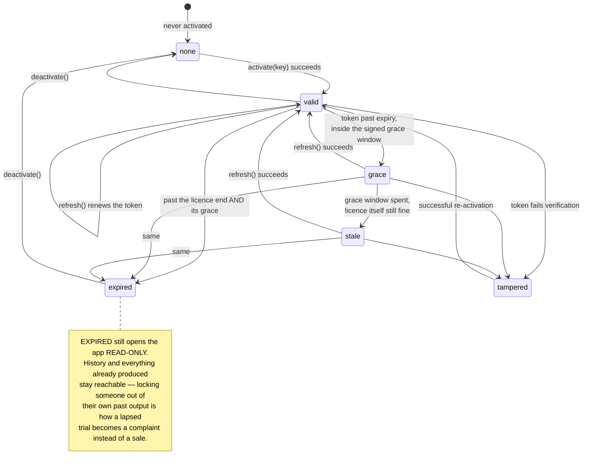
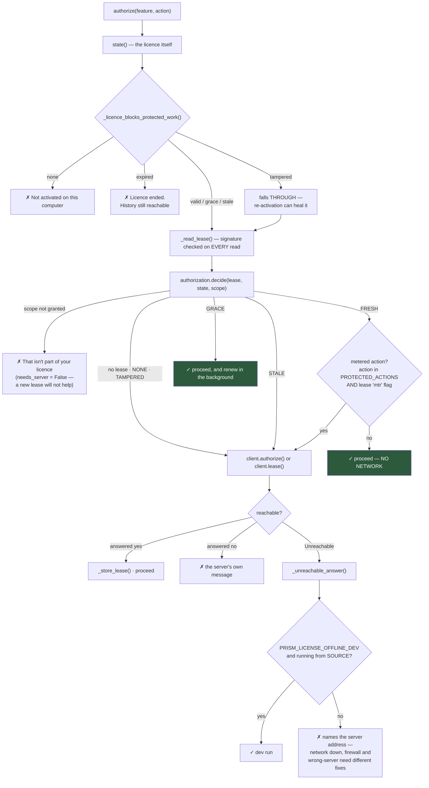

# 5 · Licensing & Authorisation

[← API reference](04-api-reference.md) · [Index](README.md) · [Next: Add-ons →](06-addons.md)

---

Product reasoning and the trade this design makes live in `LICENSING.md`.
Issuing keys is `SHIPPING.md`. **This document is the mechanism.**

Every launch and every add-on goes through `licensing/`. The server signs a
compact claims blob; the app verifies it **offline** against an Ed25519 public
key baked into the bundle.

---

## 5.1 The two keys

Prism has two different signed keys, and confusing them is the first mistake a
new maintainer makes.

| | **Licence key** | **Designation key** |
|---|---|---|
| Module | `keyformat.py` → `token.py` | `designation.py` |
| Prefix | `PRSM` (typed) → `PRSMv1` (token) | `PRSD1` |
| Answers | *May this machine run Prism, and with what features?* | *Who is this person, and what job do they do?* |
| Scope | The company's licence, one seat per machine | One member of that company |
| Drives | The gate, the paywall, the plan | The accent hue, the member folder, default agents |
| Where stored | `~/.prism/license.json` + OS credential store | `cfg["designation"]` |

`designation.looks_like_one(text)` exists so the activation dialog can tell them
apart from what was pasted.

### The licence key format

```
PRSM-XXXXX-XXXXX-XXXXX-XXXXX
```

| Property | Value |
|---|---|
| `ALPHABET` | `0123456789ABCDEFGHJKMNPQRSTVWXYZ` — Crockford-style, no I/L/O/U |
| `BODY_LEN` | 20 characters, grouped in 5s |
| Checksum | Last character, over the preceding 19 |
| `_CONFUSIONS` | `I`→`1`, `L`→`1`, `O`→`0`, `U`→`V` on input |

`normalise(text)` turns anything a user could plausibly paste into canonical
form. `is_well_formed(text)` is structural and self-consistent only — **it says
nothing about whether the key is real**.

---

## 5.2 The three signed artefacts

All three are `PREFIX.payload_b64.signature_b64`, Ed25519, verified offline
against `keys.public_keys()`.

| Artefact | Prefix | Module | Lives in | Says |
|---|---|---|---|---|
| **Token** | `PRSMv1` | `token.py` | `license.json` | This licence, this machine, these features, until this date |
| **Lease** | `PRSMLv1` | `lease.py` | `authorization.json` | This machine may do these scopes, until this time, with this offline window |
| **Payload** | `PRSMPv1` | `payload.py` | `payload.enc` | Published configuration: agent selector overrides, Groq model chain |
| *(Designation)* | `PRSD1` | `designation.py` | `config.json` | This person, this role, in this org |

**Verification is always device-bound.** `token.verify(token, device_fp=…,
public_keys=…)` fails if the fingerprint does not match. `NBF_SKEW = 300 s`
tolerates modest clock drift.

**`keys.py`:** DEVELOPMENT keys are trusted **from source only**. A frozen build
accepts production keys alone.

**`payload.py` limits:** `MAX_BYTES = 256 KB`; selectors are filtered to an
allow-list (`selectors_for`), and the model chain to `models_for`. A payload
that fails raises `PayloadError`, which is **always non-fatal** — the caller
falls back to what shipped.

---

## 5.3 Licence state machine

`licensing/status.py`



**`LicenseState`**

| Member | Meaning |
|---|---|
| `status` | `none` · `valid` · `grace` · `stale` · `expired` · `tampered` |
| `usable()` | May the customer start **new** work? |
| `days_left()` | Days until the licence ends, rounded **up**. Negative once it has |
| `has(feature)` | Entitlement check |
| `message` | The sentence to show |

`CLOCK_TOLERANCE = 1 day`. `clock_rolled_back(last_seen)` compares against the
stored high-water mark, advanced by `store.touch_clock()`.

---

## 5.4 The authorisation flow — the important part

This is what replaced a design that went to the server on **every** plan with
no offline fallback at all: up to 90 seconds against a cold host before the
customer saw anything, and one flaky connection meant no work.

> **The trade it was making — live control in exchange for our availability
> becoming our customers' availability — is now paid for by a signed lease
> instead of a round trip, which is strictly better on both sides.**



### The order, and why it is this order

1. **Local signed lease.** Valid and in scope → proceed, no network.
2. Missing, expired or out of scope → ask the backend.
3. Backend re-validates licence, device, seat, revocation, entitlement, quota
   and client version, and signs a new lease.
4. Cache it, and proceed.

### What still always goes to the server

**Metered actions on a metered licence** — `PROTECTED_ACTIONS = {'plan'}`, and
the lease's signed `mtr` flag.

> A daily allowance can only be counted where the counter lives; **a lease says
> what a client MAY do, never how much of it it has already done.** Prism's own
> pipeline is browser automation against the customer's logged-in sessions and
> costs Alphakore nothing, so only *planning* — three Groq calls — is in that
> set.

### Why `stale` is deliberately absent from the blocking list

A lease is normally the *fresher* evidence: the backend caps a lease's expiry at
the licence's own hard stop, so a valid lease implies a valid licence at the
moment it was issued.

`none`, `expired` and `tampered` are different — in each of them **we cannot
establish that the licence is alive at all**, so a lease that says otherwise is
either a clock being wound or a lease that was never ours.

> Without `_licence_blocks_protected_work`, the fast path would happily
> authorise protected work on an expired licence for as long as a lease sat on
> disk — precisely the hole that "check the cache first" opens **if the cache is
> checked *instead of* the licence rather than *as well as***.

### Why `tampered` falls through

It can be healed by a successful re-activation. Refusing without trying would
strand someone whose token was invalidated by a licence reissue.

### The honest limit of the offline window

Inside `GRACE`, a metered licence can plan without the server counting it. That
window is the backend-signed `off` claim (default **one hour**), so the exposure
is bounded, per-licence, and adjustable **without shipping an app**.

> A local counter would look like a fix and would not be one — **anything this
> process counts, this process can be patched to forget.**

### When it is called

**At the START of a run or add-on — never during one.** A pipeline is tens of
minutes of browser automation, and failing it part-way would discard real work
for a reason the customer cannot act on.

---

## 5.5 The lease

`licensing/lease.py` + `licensing/authorization.py`

**Claims** (`build_claims`): `kid` · `license_id` · `device_fp` · `scope` ·
`features` · `metered` · `jti` · `iat` · `ttl` · `off` (offline window).

**Scopes:** `SCOPE_CORE = "core"` · `SCOPE_WORKFLOW = "workflow"` ·
`SCOPE_GROK = "grok"`.

**States** — `Lease.state(now)`:

| State | Meaning | `decide()` verdict |
|---|---|---|
| `FRESH` | Inside TTL | ✓ proceed, no network |
| `GRACE` | Past TTL, inside the signed `off` window | ✓ proceed **and** renew in the background — this is the state that makes a flaky connection a non-event rather than an outage |
| `STALE` | Offline window spent | ✗ this is where offline operation stops |
| `NONE` | No lease cached | ✗ ask the server |
| `TAMPERED` | Fails verification | ✗ ask the server; `clear()` the cache |

**`Lease.allows(scope)` is scope membership only — NOT temporal.** Callers must
go through `decide()`, which combines both. That separation is deliberate: it
is why an in-date lease that simply does not cover a feature returns
`needs_server=False` — a new lease will not help unless the licence itself
changes, so it is a definite no rather than a reason to go to the network.

**`server_reachable` is what the caller has just observed, not a guess.** It is
`False` only after a request has actually failed.

> That distinction is the whole point: an arbitrary network failure must not
> equal a licence failure, but neither may "I did not bother asking" become a
> permanent offline mode.

**Throttling:** `RETRY_INTERVAL = 60 s`. `note_attempt()` records a failure;
`may_retry()` gates the next try.

---

## 5.6 Device fingerprint — one machine, one seat

`licensing/device.py`. `SALT = b"PRISM-DEVICE-V1"`; the identity is salted,
hashed and truncated.

Three tiers, best first:

| Tier | Source |
|---|---|
| `TIER_PLATFORM` | Linux: `/etc/machine-id`. macOS: `IOPlatformUUID`. Windows: registry `MachineGuid` |
| `TIER_MAC` | The MAC address |
| `TIER_RANDOM` | A random id persisted in `~/.prism` |

The tier is reported alongside the fingerprint so the server knows how much to
trust it. `reset_cache()` is **tests only** — the fingerprint is stable for a
process's lifetime.

`_hostname()` supplies a human label for the seat list, so a customer asking
*which* five machines are using their seats gets names rather than hashes.

---

## 5.7 Where the key is stored

`licensing/secretstore.py`

| Place | Constant | Notes |
|---|---|---|
| OS credential store | `KEYRING` | Service `"Prism (Alphakore)"`, account `"licence-key"`. Probed **once** — an import that fails, or a backend that is not there, must not be retried on every call |
| `~/.prism/license.json` | `FILE` | Fallback, 0600 |
| Neither | `ABSENT` | |

`store.save_key()` prefers the keyring. `forget_key()` removes it from **both**
places — "release this device" has to mean it.

`store.write_json()` is atomic and 0600. `store.read_json()` resolves **every**
failure to the default — a missing, truncated or hand-edited file is not a
crash.

---

## 5.8 Metering

`licensing/meter.py` — **what the customer consumed, never what they wrote.**

| Function | |
|---|---|
| `record(kind, *, tool, stage, prompt_tokens, completion_tokens, ok, ms)` | Buffer one event. `kind` ∈ `plan` · `run` · `stage` · `groq` · `addon` |
| `drain()` | Take everything buffered, leaving the buffer empty |
| `restore(events)` | Put them back after a failed send, **so a flaky network loses nothing** |
| `pending()` | Count |
| `install_groq_meter(router_module)` | Counts Groq tokens by wrapping the module's `requests` handle |

`MAX_BUFFERED = 2000`. Thread-safe via a module lock.

`licensing.report_usage(run_id)` is fire-and-forget: **never blocks, never
raises**.

---

## 5.9 Background renewal

`MainWindow.LICENCE_REFRESH_MS = 10 * 60 * 1000` — every ten minutes,
`_tick_licence()` renews the token and the lease **off the UI thread, forever**.

`_repaint_licence()` re-reads the cached licence and repaints. **No network,
never raises** — it is safe to call from paint code.

`refresh_licence_ui()` repaints everything that depends on the licence: the
banner, the rail's licence card (`_plan_summary()` → two lines: what you have,
and whether it is ending), and every padlock.

---

## 5.10 Plans and features

`plans.py` is **the single table the app and the licence server share**.

```
ORDER = ('studio', 'works', 'complete')
FALLBACK = ('core',)
```

| Function | |
|---|---|
| `features_for(plan_key)` | What this plan includes |
| `label(f)` / `blurb(f)` / `pitch(f)` | What the paywall says |
| `plan_of(features)` | Best-guess plan name — **display only** |
| `missing_from(plan_key)` | The upsell list, in order |

`main.py::_paywall()` is registered once via `licensing.set_paywall_handler()`,
so **the licensing package never has to import Qt**. Anything not in the licence
shows a padlock in the rail and opens the pitch rather than failing.

> **Known gap:** `plans.py` feature names and blurbs are **not** in the
> translation catalogue — they render in English regardless of interface
> language.

---

## 5.11 Development and testing

### Running without a licence server

```bash
PRISM_LICENSE_OFFLINE_DEV=1 PRISM_LICENSE_SERVER=http://127.0.0.1:9 python3 main.py
```

Both are honoured **only from source** — a frozen build ignores them, or they
would be a total bypass.

> `PRISM_LICENSE_OFFLINE_DEV` alone is **not enough** when a real server is
> reachable: it fires on a connection *failure*, and a server that answers "no"
> has not failed. **Pointing at a dead port is what makes it apply.**

Mint a local licence: `python3 devtools/mint.py install --features …`

### Do NOT export `PRISM_LICENSE_OFFLINE_DEV=1` to run the test suite

This is worth restating because the repo README used to say the opposite.

`licensing._offline_dev()` is read **only inside `_unreachable_answer()`** —
i.e. *after* the HTTP call has already raised `Unreachable`. It changes the
**answer**, never the round trip, so it cannot make a hanging test finish.

What it *does* do is open a production bypass underneath the revocation test:
with the hatch open, a revoked licence's offline fallback is granted and
`test_h_a_revoked_licence_gets_no_lease_and_loses_its_cache` fails on
`True is not false`. **That failure was read as known contamination for
months.**

`tests/conftest.py` now strips the variable per test, so the suite is insulated
either way — but do not put it back in the invocation.

### The self-test

`licensing.selftest()` verifies the committed test vector in
`licensing/testdata/`. Called by `main.py --selftest` (via `PRISM_SELFTEST`),
which also proves a packaged build is whole: every bundled resource present.

---

## 5.12 Threat model — what this does and does not stop

Stated plainly, because a maintainer needs to know which complaints are bugs and
which are the design.

| Attack | Stopped? | By what |
|---|---|---|
| Sharing a key across many machines | Yes | Seat counting on the device fingerprint |
| Editing `license.json` to extend the date | Yes | Ed25519 signature over the claims, verified every read |
| Copying `~/.prism` to another machine | Yes | Claims are device-bound; verification fails |
| Winding the system clock back | Mostly | `clock_rolled_back()` against the stored high-water mark, `CLOCK_TOLERANCE = 1 day` |
| Pointing a **release build** at a fake server | Yes | `PRISM_LICENSE_SERVER` honoured from source only |
| Pointing a **source checkout** at a fake server | **No** | Deliberate — that is the dev hatch |
| Patching the Python to skip the gate | **No** | It is Python on the customer's machine. This design does not pretend otherwise |
| Exceeding a daily allowance while offline | Bounded, not stopped | The signed `off` window (default 1 hour). A local counter would look like a fix and would not be one |

> **There is no offline fallback for a first authorisation.** If the licence
> server cannot be reached and no lease covers the action, the answer is no.
> `LICENSING.md` argues why that trade is worth making.

---

[← API reference](04-api-reference.md) · [Index](README.md) · [Next: Add-ons →](06-addons.md)
