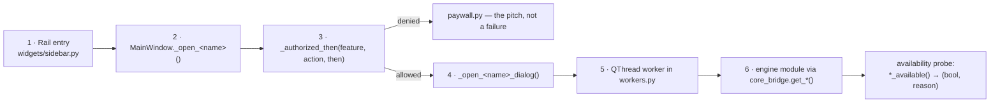

# 6 · Add-on Subsystems

[← Licensing](05-licensing.md) · [Index](README.md) · [Next: Operations →](07-operations.md)

---

Each add-on is: a rail entry (with a padlock when unlicensed) → a licence
check → a dialog or panel → one or more `QThread` workers → engine modules in
`prism_terminal/core`.

| Add-on | Feature key | Rail group | Verified against real customer data? |
|---|---|---|---|
| [Email automation](#61-email-automation-inbox) | `inbox` | ADD-ONS | **Reading: yes. Sending & PO: no** |
| [BOQ](#62-boq) | `boq` | ADD-ONS | Partially |
| [Gerber](#63-gerber) | *(engine done, GUI in progress)* | ADD-ONS | **Yes — customer's own check sheet** |
| [Email blast](#64-email-blast) | `email` | ADD-ONS | Yes |
| [Reel / Studio](#65-reel--studio) | `reel` | ADD-ONS | Yes |
| BOM & Stock | — | ADD-ONS | **Not built** — visibly *coming soon*, disabled on purpose |

> **Why a disabled shelf entry is deliberate:** a shelf that looks like a
> product line is worth more in a demo than an empty gap.

---

## 6.1 Email automation (`inbox`)

**The one used every day, and the reason the app gets opened at all.**

Built with a spring manufacturer at GIDC, Vadodara; grown to office scale —
several mailboxes, one shared register — after a second firm described exactly
that.

### Files

| Layer | File | Lines |
|---|---|---:|
| Screen | `dialogs/inquiry_dialog.py` | 2,618 |
| Setup | `dialogs/inquiry_setup_dialog.py` | 1,013 |
| Panel | `widgets/inquiry_panel.py` | 675 |
| Table | `widgets/register_table.py` | — |
| Workers | `InboxCheckWorker`, `POReadWorker`, `DraftWorker`, `SendWorker`, `InboxVerifyWorker` | — |
| Engine | `inbox` · `triage` · `register` · `quoting` · `po` · `mailflow` · `mailer` · `sop` · `drafting` | 4,046 |
| Read-only views | `dashboard_data.register_view()`, `waiting_view()`, `inquiry_stats()` | — |

### The three phases the screen is built around

The tabs are separated because **the difference between them is the difference
between software you leave running and software you supervise.**

| Phase | Tabs | Runs how |
|---|---|---|
| **READ** | 1 · What arrived | On its own. **Nothing here can cost anybody money** |
| **ANSWER** | 2 · Inquiries · 3 · What they said back · 4 · Waiting on a reply | Prism prepares; **a person presses Send** |
| **MAKE** | 5 · The order came | Put the PO against the quotation, accept it, hand the drawing to BOQ |

Full stage-by-stage data flow: [03-data-flow.md §3.2](03-data-flow.md#32-pipeline-b--email-automation-the-daily-loop).

### The properties that sell it

| Property | Mechanism |
|---|---|
| **Reads the mailboxes, never writes to them** | `readonly=True` select, `BODY.PEEK[]`. Nothing marked read, moved or deleted — the owner keeps using Outlook on the same account |
| **Sorts on local rules first** | `List-Unsubscribe`, auto-replies, known senders, narrow keyword rules settle most mail with **no AI call at all**. Only genuinely unknown senders reach the model, in one batched call |
| **Keeps an ordinary CSV register** | Opens in Excel, stays theirs whatever happens to Prism. Written atomically; hand-added columns survive; an existing register can be imported with numbering carrying on from theirs |
| **Prices from their own rate list or cost sheet** | Every line of the working shown. `Decimal` with `ROUND_HALF_UP`, Indian lakh grouping, financial-year numbering (`INQ/25-26/0087`). **No AI ever touches a figure** |
| **Reads the reply** | Accepted, declined, haggling, or a question — and **proposes** the register change. It never applies itself |
| **Chases the quiet ones** | Every two days, three times, then stops. Each reminder worded differently |
| **Puts the PO against the quotation actually sent** | Read back from the CSV written at send time, **refused on any mismatch**. Every difference listed, with rate gaps multiplied out by quantity |
| **Wins back a no** | Drafts through the AI tools in the user's own Chrome, using bargaining limits they supply in a file. **With no such file it is instructed to offer nothing on price at all** |

> **It stops twice on purpose** — before a price goes to a customer, and before
> a purchase order is accepted.

### Office scale — the rules

| Rule | Why |
|---|---|
| Mailboxes are walked **one at a time**, never in parallel | All rows land in one CSV; N fetches racing on one order book loses rows |
| Each mailbox keeps **its own** read bookmark | Two mailboxes sharing one would skip or re-import each other's mail |
| Learned corrections are **shared** across mailboxes | A sender is the same sender whichever address they wrote to |
| One dead mail server → **skip** that account | That account's problem; the others carry on |
| One locked register → **stop the walk** | The same lock would refuse every account after it, and no bookmark has moved |
| A `Mailbox` column records the arrival address | With three addresses feeding one file, "who is this customer talking to" is the first question the sheet gets asked |
| **One machine writes; everyone else reads** | See the deferred entry below |

### Verification status — read this before selling it

| Half | Status |
|---|---|
| **Reading** (fetch, sort, register, file attachments) | Well covered. Unit tests plus `devtools/inbox_demo.py` against sample mail |
| **Sending and the PO screen** | **Written and unit-tested but never run against a real mailbox** |

This is the single biggest verification gap in the product. It is stated in the
repo `README.md` and should be stated to customers.

### Deferred, with triggers (`docs/DEFERRED.md`)

| Deferred | Trigger that would change it |
|---|---|
| **Several machines writing one register** | A customer whose salespeople refuse to put mailbox passwords on the shared office PC — **heard from two firms, not one**. The build would be per-machine append journals merged by whichever Prism reads next |
| **OCR for scanned POs** | Scanned POs above roughly half a real customer's measured volume — **counted from their own register, not guessed in a meeting** — AND the customer saying the typing is what stops them using the tab |

> **Why not OCR now:** an OCR misread of a rate is worse than typing four
> fields, because it arrives with confidence — and the comparison against the
> quotation is only worth having when its inputs are exact.

### The "send unless stopped" softening

Sanctioned and designed, **not built**. `docs/EMAIL_WORKFLOW_RUNTIME.md` §1:
Prism prepares the quotation and says *"going out in 10 minutes"*; doing
nothing sends it, one tap holds it. Plus a value threshold — catalogue items
under a figure the owner sets go out on their own; anything made-to-drawing or
above it waits.

> From the customer's chair that is full automation. From ours the escape hatch
> is still there.

---

## 6.2 BOQ

Quantities off a CAD drawing (DXF via `ezdxf`) or from a written spec.

| Layer | File |
|---|---|
| Screen | `dialogs/boq_dialog.py` (410 lines) |
| Worker | `MeasureWorker` |
| Engine | `prism_terminal/core/boq.py` (827 lines) |
| Availability | `core_bridge.boq_available()` → needs `ezdxf` |

**What it measures:** lengths (lines, arcs, polylines with bulge — real arc
length, not chord), areas (shoelace; hatch external boundaries minus internal
hole loops), and counts — grouped per layer and per block, across every
layout's modelspace-equivalent geometry.

**`.dwg` support** needs a local converter: `dwg2dxf` or `ODAFileConverter`.
`find_dwg_converter()` probes for it.

> **The Rate and Amount columns are deliberately left blank.** Prism counts and
> measures; **you** price it. Deriving a price from a drawing is the mistake
> this add-on exists not to make.

**`allow_derived`** in `formatting_prompt()` is the switch between a *takeoff*
(measured quantities only) and an *estimate* (quantities plus inferred
work) — the single most important flag in this module.

**Contrast with Gerber:** BOQ **does** attach the drawing to the AI tools —
`write_files = ([cad_file] if cad_file else []) + templates + note_files`. A
building drawing is a *description* of a job; a Gerber set **is** the
customer's product. Do not copy either pattern across without asking.

**Handoff:** `InquiryDialog._make_boq()` hands an inquiry's saved drawings
straight to this add-on, so a drawing that arrived by email is measured without
being re-found on disk.

---

## 6.3 Gerber

Measure a PCB job. **No AI sees the design.**

| Layer | File | Status |
|---|---|---|
| Engine | `prism_terminal/core/gerber.py` (2,120 lines) | **Done** — commit `7cef5c4`, 26 tests |
| CLI | `/gerber` in `prism.py` | Done |
| Screen | `dialogs/gerber_dialog.py` | Built — see `docs/AFTER_THE_MERGE.md` §1 |
| Worker | `GerberWorker` | Done |
| Availability | `core_bridge.gerber_available()` — `shapely` optional | |

### The rule that must not be broken

> **The Gerber files never reach an AI.** `cmd_gerber` passes `attachments=[]`
> and a test asserts that literal string. The GUI must do the same.

### The five numbers Fine Circuits asked for, and nothing else

pcb size · min track width · min track spacing · min drill size · number of drills

### Input shape

**Drop a folder, `.zip` or `.rar` — never individual files.** A job arrives as
one archive of 9 to 17 files, and asking a customer to pick the right four is
the whole problem restated.

Four panels, exactly as the terminal shows: what is in the job, the five
numbers, the workings, and the cross-check.

### The verification ladder — cheapest first

| Step | Method | Status |
|---|---|---|
| 1 | **The job's own CAM report** — `crosscheck()` parses `.DRR`/`.REP`, compares hole counts and tool tables. Free, exact, no AI | **Built.** The 2018 sample reproduces all ten tools and 218 holes |
| 2 | **A second independent implementation** — `gerbonara` (pip, pure Python, **test-only, not a runtime dependency**). Comparing per-layer object counts found both parser bugs on 2026-08-19; all 19 layers of both samples now match exactly | **Built**, pinned by a skipping test. **Reach for this before any AI** |
| 3 | AI sanity-check on a **rendered image** plus the numbers. A PNG of the copper is not a manufacturable design, so this does not break the rule the way attaching the Gerber would | Not built |
| 4 | The raw Gerber to an AI — **only with the customer's written permission** | Not built, and gated on consent |

> **Why this ladder is written down:** on 2026-08-19 an independent measurement
> found two real defects — modal D-codes and sequential polarity — that code
> review and 900 passing tests had missed. **Both produced *plausible* wrong
> numbers with no error and no crash.** One meant Prism had read 158 of a
> layer's 470 objects and reported a clearance anyway.

### Customer validation

**2026-08-20.** Fine Circuits returned their own filled-in check sheet for both
sample jobs. Prism reconciles: size, track width, min drill and hole count exact
on both boards; spacing within a mil. Asked about the one-mil difference, the
reply was *"if its 9 or 10 it means its working"*.

Two things that reply told us:

- The sheet was filled in by **someone else** while the contact was busy. A good
  witness, not a precise one. Prism's figure is arguably tighter — the one-mil
  gap is *design rule* versus *measured worst case* (102 places on the 2018
  board sit at 9 mil).
- **"We just do DRC."** A tool already produces these numbers and the hand
  measuring is a side task. **Ask for a DRC output** — machine-generated, free,
  and a far better witness than a spreadsheet. It may also mean **the five
  numbers are not the product and the DRC is.** Worth finding out.

### Untested constructs

Neither sample contains these, so nothing proves they work. Prism warns when it
meets them; **a warning is not a guarantee.**

- **Arcs** (`G02`/`G03`) — zero in both jobs. Implemented, never exercised on real data.
- **Aperture macros** (`%AM`) on a copper layer — macro flashes are counted but given no geometry, so they take no part in spacing.
- **Step-and-repeat** (`%SR`) panelisation — detected and reported, not expanded.
- **Negative inner planes**, where the plane layer is drawn inverted.

The contact has said the two samples are **deliberately simple** and that complex
files will follow. Run steps 1 and 2 of the ladder on every one of them.

### Where the add-on actually goes — the whole enquiry

An incoming PCB job, end to end:

| # | Step | Owner |
|---|---|---|
| 1 | Email/WhatsApp lands with a zip | Prism — Email automation ✅ |
| 2 | Identify layers, measure the board | Prism — `core/gerber.py` ✅ |
| 3 | **Can we make it? What is at our limit?** | **NOT BUILT** |
| 4 | **How many boards fit our panel?** | **NOT BUILT** |
| 5 | **Cost it — laminate, layers, finish** | **NOT BUILT** |
| 6 | Write the quote | Prism — drafting ✅ |
| 7 | Send it | Prism — mailer ✅ |
| 8 | Chase it at 2 days | Prism — mailflow ✅ |

> **CAM software (Genesis 2000, InCAM, CAM350, UcamX) owns step 2 alone.** We
> own 1, 2, 6, 7, 8. **Steps 3–5 are the whole remaining product, and none of
> them need to touch a Gerber.**

**The sentence:** *CAM tells you what the board is. Prism tells you what to
charge for it, writes the quote, sends it, and chases it — using the AI
subscriptions you already pay for, without your customer's design ever leaving
your computer.*

### The realistic first build — and what NOT to build

| Decision | Step | Reason |
|---|---|---|
| **Build** | 3 · capability check | One document from him, no pricing, no credentials, no assumption about how the job arrived. It turns Prism from "a thing that reads Gerbers" into "a thing that answers the question I actually have" |
| **Do not build yet** | 4 · panel utilisation | Needs his panel sizes, edge rails, scoring rules, tooling margins. Real geometry — **code, not an AI** — but a week of work, and wrong in a way he will spot instantly if any input is guessed. Wait until he asks |
| **Do not build yet** | 5 · costing | Needs his entire rate structure, which is his margin. Asking early reads as asking for his books |
| **Do not build yet** | sending | He has not said he wants Prism touching his mail, and credentials are the highest-friction thing on the list |

**The staged ask** — each stage must be worth something on its own:

| Stage | What to ask for | Risk |
|---|---|---|
| 1 | **Capability sheet** — thinnest track, tightest gap, smallest drill, layer count, finishes, panel sizes | **Low.** He has it already; it is what he quotes against |
| 2 | **How he prices** + a **sample quote he has sent** + company details | **Medium.** Pricing is his margin; he will not share it until stage 1 has proved useful |
| 3 | **Sending account** (SMTP) | **High.** Credentials. Last thing asked for, never the first |

### The assumption to NOT make

**Not every job arrives by email.** Window fabricators showed this: WhatsApp
photos, a phone call, a worker's notebook. A PCB fab may take jobs through a
customer portal, a shared drive, a WhatsApp group, or an ERP nobody outside the
company has heard of.

> **The add-on must work from a folder on his machine, full stop.** If a zip
> lands there by any means, it is measured. Email ingestion is one route in, not
> *the* route in.

---

## 6.4 Email blast

| Layer | File |
|---|---|
| Screen | `dialogs/email_dialog.py` (687 lines) |
| Workers | `SendWorker`, `VerifyWorker` |
| Engine | `prism_terminal/core/mailer.py` (502 lines) |

Recipients come from an attached CSV and/or addresses in the goal text, with a
**Search for their public email** fallback that runs a research stage and a
structuring stage and writes a real CSV to disk as a durable record.

The draft is generated through a normal pipeline stage and is **editable**, then
confirm-and-send from *the user's own* account. First use opens the one-time
SMTP setup (Gmail needs an app password).

One message **per recipient**, so `{name}` can be substituted, with
`SEND_DELAY = 2.0 s` between them.

Full flow: [03-data-flow.md §3.6](03-data-flow.md#36-pipeline-f--email-blast).

---

## 6.5 Reel / Studio

| | **Reel** | **Studio** |
|---|---|---|
| Engine | `core/reel.py` (1,810 lines) | `core/reel_web.py` (1,765 lines) |
| Frames | Drawn with **Pillow** | A real **web page** filmed in a paused Chromium |
| Availability | `reel_available()` — Pillow + FFmpeg | `studio_available()` — plus a browser engine |
| Output | 1080×1920 `.mp4` | Same |

**FFmpeg ships inside the build** (`imageio-ffmpeg`). If it is ever missing,
Prism downloads the same wheel and **verifies it against the SHA-256 PyPI
publishes for that exact file** before unpacking it (`core/ffmpeg.py`,
`FFmpegWorker`).

### Why Studio is a conversation

The design stage is **one turn for the look and a storyboard, then one turn per
scene**, each laid out at 1080×1920 and corrected before the next is asked for.

> Asking for the whole reel in one reply is what made the old output look like a
> slide deck — **a scene got about 278 characters, which is a headline and a
> subhead.** See `CHANGES.md` → Round 6.

### The house style

`~/Desktop/studio_pcb.mp4` (26.7 s, 1080×1920) is the standard to hold every
future reel against: dark, terminal-styled, and built from the customer's own
material — a real file listing, 238 holes drawn as 238 dots, the board drawn
with dimension lines, a two-column panel contrasting what stays on the machine
with what the AI ever sees.

### Open gaps (`docs/AFTER_THE_MERGE.md` §4, `docs/DEFERRED.md`)

| Gap | Detail |
|---|---|
| **Invented numbers — fix first** | `studio_pcb.mp4` claims 238 holes, 125.93 × 76.40 mm and 0.152 mm. **The AI made all three up**, because the reader did not exist when the script was written. The real board reads 218 holes, 90.17 × 90.17 mm, 0.203 mm, 4 layers, confirmed against the customer's own CAM report. Re-render those scenes |
| **No hooks** | Nothing in `design_instructions()` or `scene_instructions()` treats scene 1 differently from scene 4 — but a reel without a hook is never watched to the end, so the opening ~1.5 seconds is the whole bet |
| **Adaptiveness unverified** | The pipeline asks for "build it from the customer's own material, not from adjectives"; nothing verifies it happened |
| **Storyboard is advice, not a contract** | Nothing checks that the scene the model wrote is the scene its storyboard described. Trigger: a reel where every scene lays out clean and the film still reads as a deck |
| **Motion seams — claimed done, not found in code** ⚠️ | `docs/DEFERRED.md` records this as **DONE**, with a `motion_faults()` that checks the two measurable faults (scene wrapper animating as one slab; one animation used by 70%+ of everything that moves). **No `motion_faults` exists anywhere in `prism_terminal/core/` at the pinned submodule commit** — the nearest real function is `brand_faults()` (`reel_web.py:373`). Either the work landed upstream and the submodule pin is behind, or the entry was written ahead of the code. **Verify before relying on it** |

---

## 6.6 Cross-cutting: how an add-on is wired

Adding one follows the same six steps every time.

**The availability probe is not optional.** Heavy dependencies (`selenium`,
`ezdxf`, `shapely`, Pillow, FFmpeg) are probed lazily so a missing one produces
a sentence the user can act on rather than an import error at boot — and so
startup stays fast.

**Feature keys** live in `plans.py` and are shared with the licence server.
`AGENT_FEATURES = {'Prism Reel': 'reel', 'Prism Studio': 'reel'}` in
`main_window.py` maps agent names onto feature keys for the plan rows.

---

[← Licensing](05-licensing.md) · [Index](README.md) · [Next: Operations →](07-operations.md)
